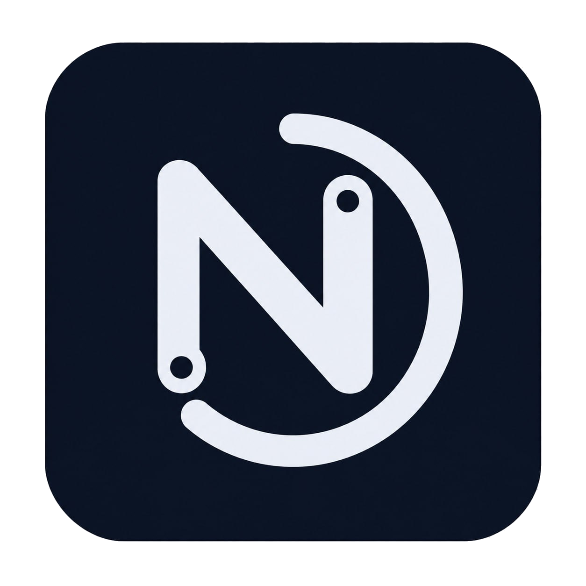
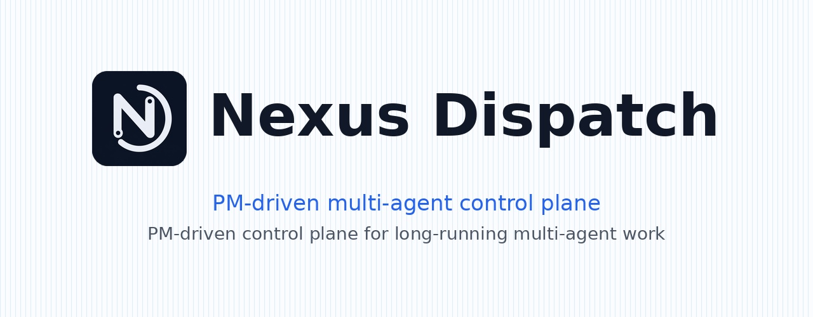

<div align="center">
  <h1>
    
    Nexus Dispatch
  </h1>
  
  <p><strong>PM-driven multi-agent control plane.</strong></p>
  <p>
    <a href="./README.md">English</a> ·
    <a href="./README.zh-CN.md">简体中文</a> ·
    <a href="./README.zh-TW.md">繁體中文</a>
  </p>
</div>

<p align="center">
  
  
  
  
  
</p>


---

> A single PM brain dispatches work to heterogeneous AI agents, tracks every state transition through a state-machine runtime, and verifies completion with structured proof gates — unattended, observable, zero-trust.

---

## What It Is / What It Is Not

| ✅ What It Is | ❌ What It Is Not |
| --- | --- |
| A **control plane** for coordinating AI agents | A general-purpose agent framework |
| A **PM brain** that dispatches, tracks, and verifies | A chat-based task bot |
| **API-first** — all state through REST | A shared-database free-for-all |
| **Single VPS, single SQLite** deployment | A distributed Kubernetes cluster |
| **Worker-contract driven** — agents are stateless executors | An agent marketplace or plugin system |
| **Proof-gated completion** — artifacts required | "Mark done" without evidence |

---

## What It Does

Nexus Dispatch does three things — and does them well:

| | What | How |
| --- | --- | --- |
| 📤 **Dispatch** | Route the right task to the right agent at the right time. | DAG-based dependency resolution, lane routing, priority evaluation. No manual assignment. |
| 📡 **Track** | Know where every task stands, always. | FSM-driven lifecycle (`created → dispatched → running → completion_pending → completed`). Every transition through REST API. |
| ✅ **Verify** | Nothing is "done" until proof passes the gate. | Workers submit structured artifacts (Git SHA, file hashes, screenshots). Review policy routes high-risk work to human review; routine work auto-advances on machine proof. |

---

## 5-Minute Happy Path

Get from zero to a dispatched task in under 5 minutes.

### Prerequisites

- Node.js 18+
- Docker & Docker Compose (for containerized deploy) OR bare-metal VPS

### Step 1 — Clone & Configure (1 min)

```bash
git clone https://github.com/zcweah1981/Nexus-Dispatch.git
cd Nexus-Dispatch
cp .env.example .env
# Edit .env — set API_AUTH_TOKEN and project settings. Never commit .env.
```

### Step 2 — Launch (1 min)

```bash
docker compose up -d --build

# Verify: unauthenticated request should return 401
curl -i "http://localhost:8000/api/v1/runtime/tasks/pending?project_id=nexus-dispatch"

# Verify: authenticated request should return JSON
curl -sS \
  -H "Authorization: Bearer $API_AUTH_TOKEN" \
  "http://localhost:8000/api/v1/runtime/tasks/pending?project_id=nexus-dispatch"
```

### Step 3 — Register a Worker (1 min)

```bash
curl -sS -X POST \
  "http://localhost:8000/api/v1/runtime/projects/nexus-dispatch/agents" \
  -H "Authorization: Bearer $API_AUTH_TOKEN" \
  -H "Content-Type: application/json" \
  -d '{
    "agent_id": "my-worker-1",
    "endpoint": "http://worker-host:8647/v1/runs",
    "lane": "DEV",
    "dialect": "openclaw",
    "soul_prompt": "Execute assigned DEV tasks and return structured proof.",
    "tools_allowed": ["terminal", "file", "web"],
    "status": "online"
  }'
```

### Step 4 — Dispatch a Task (1 min)

```bash
curl -sS -X POST \
  "http://localhost:8000/api/v1/runtime/tasks" \
  -H "Authorization: Bearer $API_AUTH_TOKEN" \
  -H "Content-Type: application/json" \
  -d '{
    "project_id": "nexus-dispatch",
    "title": "Deployment smoke task",
    "objective": "Verify the Runtime API can create and dispatch a task.",
    "lane_required": "DEV",
    "acceptance_criteria": ["Runtime API returned a task object", "Worker received the dispatch"],
    "acceptance_mode": "group_only",
    "max_retries": 1
  }'
```

### Step 5 — Observe (1 min)

- **WebUI:** Open `http://localhost:3030` — watch the task appear, get dispatched, and complete.
- **Telegram:** If configured, your agent's bot posts a human-readable summary — no internal IDs, no raw JSON.

👉 **Full deployment guide, systemd setup, and troubleshooting:** [docs/install.md](./docs/install.md)

---

## Worker Contract

Workers interact with Nexus Dispatch through a simple HTTP contract. No SDK required.

### Registration

Workers register via `POST /api/v1/runtime/projects/:projectId/agents`:

```json
{
  "agent_id": "long-coder-1",
  "endpoint": "http://worker-host:8647/v1/runs",
  "lane": "DEV",
  "dialect": "openclaw",
  "soul_prompt": "Execute assigned DEV tasks only and return structured proof.",
  "tools_allowed": ["terminal", "file", "web"],
  "status": "online"
}
```

### Receive Dispatch

The Daemon POSTs a task payload to the worker's `endpoint`:

```json
{
  "task_id": "uuid",
  "project_id": "nexus-dispatch",
  "title": "Implement X",
  "objective": "Build feature X with tests.",
  "lane_required": "DEV",
  "acceptance_criteria": ["Feature X passes tests", "Git SHA provided"],
  "acceptance_mode": "group_only",
  "reviewer": "seiya",
  "max_retries": 2
}
```

### Submit Proof

Workers POST structured proof to `POST /api/v1/runtime/tasks/:taskId/proof`:

```json
{
  "run_status": "completed",
  "proof": {
    "repo_proof": { "git_sha": "abc1234", "branch": "feat/x" },
    "run_proof": { "tests_passed": 12, "tests_failed": 0 },
    "summary": "Feature X implemented with 12 passing tests."
  }
}
```

### Key Rules

- Workers **never** access SQLite directly — all interaction through the Runtime API.
- Workers **never** make scheduling decisions — the PM Brain owns all routing.
- Workers **must** submit structured proof — plain-text "done" is rejected.
- Workers **may** be offline between tasks — the Daemon retries on a configurable schedule.

---

## Core Concepts

| Term | Definition |
| --- | --- |
| **PM Brain** | The single scheduling authority. Resolves DAGs, evaluates priorities, gates reviews. Implemented as a headless Daemon tick loop. |
| **Worker** | A stateless executor. Claims a task, runs it, submits proof. Never makes scheduling decisions. |
| **Lane** | Worker specialization: `DEV`, `DESIGN`, `OPS`, `CONTENT`. Tasks declare which lane they need. |
| **Dialect** | Communication protocol between Daemon and Worker: `hermes` (Telegram-native) or `openclaw` (HTTP webhook). |
| **FSM** | Finite State Machine governing task lifecycle. No agent can skip states or self-mark done. |
| **Proof Gate** | Completion gate requiring structured artifacts. Types: `repo_proof`, `run_proof`, `review_proof`, `report_proof`, `ops_proof`. |
| **Review Policy** | Routing rule for task review: `pm_audit_immediate` (human gate) or `group_only` (machine proof unlocks downstream). |
| **Blueprint** | Frozen project plan. Phase-gated: freeze → thaw next phase → advance milestone. |
| **SSoT** | Single Source of Truth. SQLite visible only inside the API server process. |

---

## Product Flow


1. **Create task** — PM defines lane, priority, dependencies, and review policy.
2. **Dispatch** — PM Brain resolves DAG order and routes the run to the right worker lane.
3. **Worker execute** — Worker claims the task, performs the work, and returns structured output.
4. **Proof + artifact** — Git SHA, files, images, and completion payloads come back through the Runtime API.
5. **Review + verified delivery** — Policy decides auto-pass, rework, or human review before visible delivery.

---

## Architecture


```
┌─────────────────────────────────────────────────────────┐
│                     Human Layer                         │
│  Telegram (per-agent bots)  ·  WebUI (read-only SSE)    │
└──────────┬──────────────────────────┬───────────────────┘
           │ notifications            │ observability
           ▼                          ▼
┌─────────────────────────────────────────────────────────┐
│              Runtime API (Express :8000)                 │
│  ┌─────────┐ ┌──────────┐ ┌──────────┐ ┌────────────┐  │
│  │ Tasks   │ │ Runs     │ │ Reports  │ │ Blueprints │  │
│  │ Agents  │ │ Cronjobs │ │ Artifacts│ │ Review     │  │
│  └─────────┘ └──────────┘ └──────────┘ └────────────┘  │
│              Bearer Token Auth · /api/v1/runtime/*       │
└──────────┬──────────────────────────────────┬───────────┘
           │ tick loop                        │ register
           ▼                                  ▼
┌────────────────────┐            ┌───────────────────────┐
│  PM Daemon         │  dispatch  │  Worker Agents        │
│  · DAG resolution  │ ────────▶  │  · claim → run        │
│  · Priority eval   │  ◀──────── │  · submit proof       │
│  · Review gating   │  artifact  │  · POST results       │
└────────────────────┘            └───────────────────────┘
           │
           ▼
┌────────────────────┐
│  SQLite (SSoT)     │  ← API-internal only
│  Prisma DAL        │    No external access
└────────────────────┘
```

**Key invariant:** SQLite is visible only inside the API server process. Workers, Daemon, and WebUI never touch the database directly.

---

## Documentation Index

| Document | Description |
| --- | --- |
| [docs/install.md](./docs/install.md) | Full deployment guide: Docker, systemd, smoke tests |
| [docs/install.zh-CN.md](./docs/install.zh-CN.md) | 简体中文部署指南 |
| [docs/install.zh-TW.md](./docs/install.zh-TW.md) | 繁體中文部署導覽 |
| [docs/TRILINGUAL-STRATEGY.md](./docs/TRILINGUAL-STRATEGY.md) | Trilingual docs strategy and naming rules |
| [docs/v8/](./docs/v8/) | Runtime proof, API contracts, schema specs |
| [docs/assets/](./docs/assets/) | Product visuals: logo, hero, flow, architecture |

---

## Project Status

| | Status |
| --- | --- |
| **Phase** | V8 Clean Rebuild (R0–R9) |
| **Current** | Active development — control plane MVP |
| **Stable capabilities** | Schema + Prisma DAL · Runtime API + FSM Controller · Daemon / Dispatcher · Review / Acceptance · Completion Reports · Telegram Notifications |
| **In progress** | WebUI rebuild · Project Cron Registry · E2E Release Candidate |

### Recommended Use

- ✅ **Best for:** Teams running 3+ heterogeneous AI agents on long-running tasks (coding, design, content, ops) who need a PM brain to coordinate dispatch, track progress, and verify delivery.
- ✅ **Best for:** Solo builders who want fire-and-forget multi-agent workflows without building orchestration from scratch.
- ⚠️ **Not ready for:** Multi-tenant SaaS, K8s auto-scaling, or agent marketplace use cases.

---

## License

This project is licensed under the [MIT License](./LICENSE).

Copyright (c) 2026 Nexus Dispatch contributors
