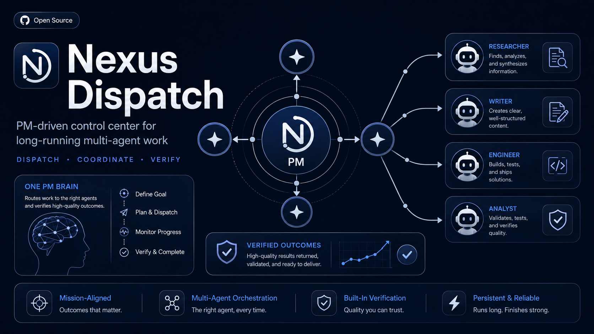
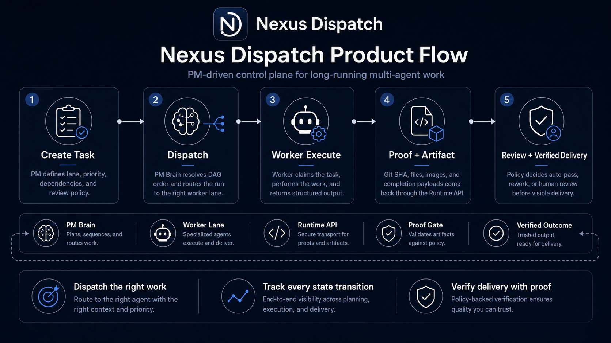

<div align="center">
  <h1>
    
    Nexus Dispatch
  </h1>
  <p><strong>PM-driven control plane for long-running multi-agent work.</strong></p>
  <p>
    <a href="./README.md">English</a> ·
    <a href="./README.zh-CN.md">简体中文</a> ·
    <a href="./README.zh-TW.md">繁體中文</a>
  </p>
</div>

<p align="center">
  
  
  
  
  
</p>

<p align="center">
  
</p>

---

> A PM-style control plane for independent AI workers. Nexus Dispatch routes work, tracks every state transition through a runtime state machine, and verifies completion through structured proof gates — unattended, observable, and auditable.

---

## What It Is / What It Is Not

| ✅ What It Is | ❌ What It Is Not |
| --- | --- |
| A **control plane** for coordinating AI agents | A general-purpose agent framework |
| A **PM brain** that dispatches, tracks, and verifies | A chat-based task bot |
| **API-first** — all state through REST | A shared-database free-for-all |
| **Single VPS, single SQLite** deployment | A distributed Kubernetes cluster |
| **Worker-contract driven** — agents are stateless executors | An agent marketplace or plugin system |
| **Proof-gated completion** — artifacts required | "Mark done" without evidence |

---

## What It Does

<p align="center">
  
</p>

| Capability | Outcome | Mechanism |
| --- | --- | --- |
| **Dispatch** | The right task reaches the right worker. | DAG resolution, lane routing, priority evaluation. No manual assignment. |
| **Track** | Every task has a visible lifecycle. | FSM transitions (`created → dispatched → running → completion_pending → completed`) through the Runtime API. |
| **Verify** | Completion requires evidence. | Runs, artifacts, proof payloads, and review policy. High-risk tasks require human review; routine work auto-advances on machine proof. |

---

## 5-Minute Runtime Smoke Test

Get from zero to a running Runtime API and a dispatchable task in under 5 minutes.

> **Note:** This smoke test starts the Runtime API and creates a dispatchable task. It does not include a mock worker — task completion requires a real Worker endpoint.

### Prerequisites

- Node.js 18+
- Docker & Docker Compose (for containerized deploy) OR bare-metal VPS

### Step 1 — Clone & Configure (1 min)

```bash
git clone https://github.com/zcweah1981/Nexus-Dispatch.git
cd Nexus-Dispatch
cp .env.example .env
# Edit .env — set YOUR_RUNTIME_TOKEN/API auth and project settings. Never commit .env.
```

### Step 2 — Launch (1 min)

```bash
docker compose up -d --build

# Verify: unauthenticated request should return 401
curl -i "http://localhost:8000/api/v1/runtime/tasks/pending?project_id=nexus-dispatch"

# Verify: authenticated request should return JSON
curl -sS \
  -H "Authorization: Bearer YOUR_RUNTIME_TOKEN" \
  "http://localhost:8000/api/v1/runtime/tasks/pending?project_id=nexus-dispatch"
```

### Step 3 — Register a Worker (1 min)

```bash
curl -sS -X POST \
  "http://localhost:8000/api/v1/runtime/projects/nexus-dispatch/agents" \
  -H "Authorization: Bearer YOUR_RUNTIME_TOKEN" \
  -H "Content-Type: application/json" \
  -d '{
    "agent_id": "my-worker-1",
    "endpoint": "http://worker-host:8647/v1/runs",
    "lane": "DEV",
    "dialect": "openclaw",
    "soul_prompt": "Execute assigned DEV tasks and return structured proof.",
    "tools_allowed": ["terminal", "file", "web"],
    "status": "online"
  }'
```

### Step 4 — Dispatch a Task (1 min)

```bash
curl -sS -X POST \
  "http://localhost:8000/api/v1/runtime/tasks" \
  -H "Authorization: Bearer YOUR_RUNTIME_TOKEN" \
  -H "Content-Type: application/json" \
  -d '{
    "project_id": "nexus-dispatch",
    "title": "Deployment smoke task",
    "objective": "Verify the Runtime API can create and dispatch a task.",
    "lane_required": "DEV",
    "acceptance_criteria": ["Runtime API returned a task object", "Worker received the dispatch"],
    "acceptance_mode": "group_only",
    "max_retries": 1
  }'
```

### Step 5 — Observe (1 min)

- **WebUI:** Open `http://localhost:3030` — watch the task appear and get dispatched.
- **Telegram:** If configured, your agent's bot posts a human-readable summary — no internal IDs, no raw JSON.

👉 **Full deployment guide, systemd setup, and troubleshooting:** [docs/install.md](./docs/install.md)

---

## Worker Contract

Workers interact with Nexus Dispatch through a simple HTTP contract. No SDK required.

- Register a project-scoped worker endpoint and lane.
- Receive dispatch payloads from the PM Daemon.
- Submit Runs, Artifacts, and transition proof through the Runtime API.
- Never access SQLite, make scheduling decisions, or mark tasks complete directly.

👉 Full integration details: [docs/worker-contract.md](./docs/worker-contract.md)

---

## Core Concepts

| Term | Definition |
| --- | --- |
| **PM Brain** | The single scheduling authority. Resolves DAGs, evaluates priorities, gates reviews. Implemented as a headless Daemon tick loop. |
| **Worker** | A stateless executor. Claims a task, runs it, submits proof. Never makes scheduling decisions. |
| **Lane** | Worker specialization: `DEV`, `DESIGN`, `OPS`, `CONTENT`. Tasks declare which lane they need. |
| **Dialect** | Communication protocol between Daemon and Worker: `hermes` (Telegram-native) or `openclaw` (HTTP webhook). |
| **FSM** | Finite State Machine governing task lifecycle. No agent can skip states or self-mark done. |
| **Proof Gate** | Completion gate requiring structured artifacts. Types: `repo_proof`, `run_proof`, `review_proof`, `report_proof`, `ops_proof`. |
| **Review Policy** | Routing rule for task review: `pm_audit_immediate` (human gate) or `group_only` (machine proof unlocks downstream). |
| **Blueprint** | Frozen project plan. Phase-gated: freeze → thaw next phase → advance milestone. |
| **SSoT** | Single Source of Truth. SQLite visible only inside the API server process. |

---

## Product Flow



1. **Create task** — PM defines lane, priority, dependencies, and review policy.
2. **Dispatch** — PM Brain resolves DAG order and routes the run to the right worker lane.
3. **Worker execute** — Worker claims the task, performs the work, and returns structured output.
4. **Proof + artifact** — Git SHA, files, images, and completion payloads come back through the Runtime API.
5. **Review + verified delivery** — Policy decides auto-pass, rework, or human review before visible delivery.

---

## Architecture


Core invariants:

1. **Runtime API is the only state boundary.** All reads and writes go through REST. SQLite is internal to the API server process.
2. **Workers are stateless executors.** They receive dispatch, execute, and submit proof. They never touch SQLite or make scheduling decisions.
3. **PM Daemon owns scheduling, dispatch, retry, and review gates.** No agent self-assigns or self-completes.

---

## Security Model

Nexus Dispatch is designed around strict runtime boundaries:

- All state changes go through the Runtime API.
- Workers never access SQLite directly.
- Every `/api/v1/runtime/*` request requires Bearer token authentication.
- Worker output is accepted only as structured runs, artifacts, and proof payloads.
- Telegram messages contain human-readable summaries — no raw secrets, internal IDs, or payloads.
- Public deployments should run behind HTTPS and keep `.env` out of version control.

---

## Documentation

| Entry | Purpose |
| --- | --- |
| [Docs Index](./docs/index.md) | All public docs entry points in one place |
| [Run in 5 minutes](./docs/install.md) | Docker, systemd, smoke tests |
| [Connect a Worker](./docs/worker-contract.md) | Register workers, receive dispatch, submit artifacts |
| [Runtime API](./docs/runtime-api.md) | Tasks, runs, artifacts, transitions, review policies |
| [Architecture](./docs/architecture.md) | Runtime boundary, daemon, worker fleet, SQLite SSoT |

---

## Project Status

| | Status |
| --- | --- |
| **Phase** | V8 Clean Rebuild (R0–R9) |
| **Current** | Active development — control plane MVP |
| **Stable capabilities** | Schema + Prisma DAL · Runtime API + FSM Controller · Daemon / Dispatcher · Review / Acceptance · Completion Reports · Telegram Notifications |
| **In progress** | WebUI rebuild · Project Cron Registry · E2E Release Candidate |
| **Recommended today** | Personal agent fleet, internal automation, single-VPS control plane |
| **Not recommended yet** | Public multi-tenant SaaS, regulated workloads, high-scale distributed queue replacement |

---

## Validation Commands

```bash
npm run build              # TypeScript compilation
npm test                   # Jest test suite
npm run validate:api-deploy # Route boundary + deploy validation
```

---

## License

This project is licensed under the [MIT License](./LICENSE).

Copyright (c) 2026 Nexus Dispatch contributors
