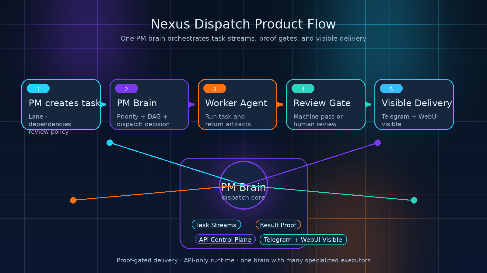
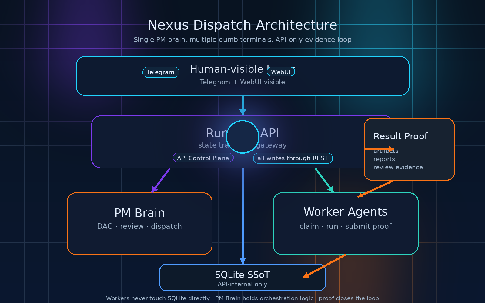

<div align="center">
  
  <br />
  
  <h1>Nexus Dispatch</h1>
  <p><strong>The Control Center for Autonomous AI Agent Teams</strong></p>
  <p>
    <a href="./README.md">English</a> ·
    <a href="./README.zh-CN.md">简体中文</a> ·
    <a href="./README.zh-TW.md">繁體中文</a>
  </p>
</div>

<p align="center">
  
  
  
  
  
  
  
  
  
</p>

---

> **One PM brain orchestrating your entire AI agent fleet — dispatching, tracking, and verifying every task to completion.**
>
> Nexus Dispatch is the mission control your multi-agent team has been missing. A single PM-style brain coordinates heterogeneous AI agents through an API-first, state-machine-driven runtime with proof-based delivery gates — so the right work reaches the right agent, gets done with verifiable evidence, and stays on track. Fully unattended. Fully observable.

---

## ✨ Why Nexus Dispatch?

You have agents — Codex, Claude, Hermes, OpenClaw, custom workers — but no one's running the show. Tasks slip through the cracks. Completions go unverified. Chat channels drown in noise.

Nexus Dispatch gives you a **PM brain** that never sleeps:

| ✅ What You Get | ⚙️ How It Works |
| --- | --- |
| 🧠 **Intelligent dispatch** | PM Brain evaluates priorities, resolves DAG dependencies, and routes work to the right agent at the right time. |
| 🔁 **Long-running, unattended workflows** | Fire-and-forget task chains that run to completion — even across hours or days — with automatic retry and state recovery. |
| 🛡️ **Proof-based delivery** | Workers submit structured artifacts (Git SHA, file hashes, screenshots). Nothing is "done" until proof passes the gate. |
| 🤖 **Multi-agent fleet management** | Register heterogeneous workers by lane and concurrency. The Daemon fans out work and collects results through a single API boundary. |
| 📱 **Full visibility via Telegram + WebUI** | Each agent notifies through its own bot. The WebUI dashboard streams live task state, DAG progress, and artifact galleries via SSE. |
| 🔌 **API-first runtime** | Every state transition goes through REST. No shared database, no SSH tunnels, no agent with direct DB access — clean API-only architecture. |
| 🐳 **Docker & systemd ready** | Single VPS deployment. One SQLite file. Zero external database dependencies. Production-grade in minutes. |

---

## 🏷️ Product Highlights

```
🧠 PM Brain              ·  DAG-aware priority dispatch with dependency resolution
⏳ Long-running Tasks    ·  Unattended multi-hour/multi-day workflow chains
🤖 Multi-Agent Fleet     ·  Heterogeneous workers with lane routing & concurrency control
🛡️ Proof-based Delivery  ·  Structured artifacts required at every completion gate
📱 Telegram + WebUI      ·  Per-agent bot notifications + live SSE dashboard
🔌 API Control Plane     ·  REST-only state machine, Bearer token auth, no direct DB access
🔄 Unattended Workflow   ·  Fire-and-forget with automatic retry, blocked-state recovery
🐳 Docker/systemd Ready ·  Single VPS, one SQLite file, zero external deps
```

---

## 👥 Who Is This For?

| Role | How You Use It |
| --- | --- |
| **AI Agent Teams** | Dispatch coding, design, content, and review tasks to specialized agents with lane-based routing and concurrency control. |
| **Engineering Leads** | Monitor the full task lifecycle via WebUI + SSE — from dispatch through review to completion with artifact proof. |
| **Solo Builders with Agents** | Run a lightweight PM Brain that keeps your multi-agent workflow honest without building orchestration from scratch. |
| **Ops & Platform Teams** | Deploy via Docker Compose or systemd on a single VPS. SQLite SSoT means no external database to manage. |

---

## 🖼️ Product Flow

*How work flows through Nexus Dispatch — from task creation to verified delivery. A single PM Brain orchestrates multi-agent dispatch with proof-based gates at every stage.*



> 💡 **Key advantage**: Tasks run unattended across hours or days. The PM Brain resolves DAG dependencies, dispatches to the right agent, and gates completion on verifiable proof — no manual babysitting required.

1. **PM creates a task** with lane, dependencies, and review policy.
2. **PM Brain dispatches it** to the right specialized worker over the Runtime API.
3. **Worker executes and submits proof** — runs, artifacts, and completion payloads come back through the same API boundary.
4. **Review gate accepts or rejects** based on policy and proof quality. High-risk tasks require human review; routine work auto-advances on machine-verified proof.
5. **Telegram + WebUI reflect the result** in human-readable form — no internal IDs or raw secrets in chat.

---

## 🏗️ Architecture

*System structure — single PM brain, multiple dumb terminals, API-only data flow. Full observability through Telegram + WebUI.*



> 💡 **Key advantage**: One brain, many hands. The PM Brain holds all scheduling logic; workers are stateless executors. Every state transition goes through the REST API, creating a complete audit trail — fully observable, fully verifiable.

```
┌─────────────────────────────────────────────────────────┐
│                     Human Layer                         │
│  Telegram (per-agent bots)  ·  WebUI (read-only SSE)    │
└──────────┬──────────────────────────┬───────────────────┘
           │ notifications            │ observability
           ▼                          ▼
┌─────────────────────────────────────────────────────────┐
│              Runtime API (Express :8000)                 │
│  ┌─────────┐ ┌──────────┐ ┌──────────┐ ┌────────────┐  │
│  │ Tasks   │ │ Runs     │ │ Reports  │ │ Blueprints │  │
│  │ Agents  │ │ Cronjobs │ │ Artifacts│ │ Review     │  │
│  └─────────┘ └──────────┘ └──────────┘ └────────────┘  │
│              Bearer Token Auth · /api/v1/runtime/*       │
└──────────┬──────────────────────────────────┬───────────┘
           │ tick loop                        │ register
           ▼                                  ▼
┌────────────────────┐            ┌───────────────────────┐
│  PM Daemon         │  dispatch  │  Worker Agents        │
│  · DAG resolution  │ ────────▶  │  · claim → run        │
│  · Priority eval   │  ◀──────── │  · submit proof       │
│  · Review gating   │  artifact  │  · POST results       │
└────────────────────┘            └───────────────────────┘
           │
           ▼
┌────────────────────┐
│  SQLite (SSoT)     │  ← API-internal only
│  Prisma DAL        │    No external access
└────────────────────┘
```

**Key invariant:** SQLite is visible only inside the API server process. Workers, Daemon, and WebUI never touch the database directly — they go through the Runtime API exclusively.

---

## 🧼 Sanitized Usage Screenshot

*Real product usage capture — sanitized WebUI settings/registry screen from a live local runtime. Internal policy IDs, reviewer agent IDs, and runtime-sensitive strings are redacted before publication.*


---

## ⚡ Core Capabilities

### 🔄 State-Machine Task Lifecycle

Every task follows a strict finite-state machine: `created → dispatched → running → completion_pending → review_pending → completed` with retry, blocked, dead-letter, and cancelled branches. No shortcuts. No agent can skip states or self-mark done.

### 🔗 DAG-Based Dependency Resolution

Tasks declare dependencies. The PM Brain's DAG engine performs topological ordering with cycle detection — circular dependencies are rejected before dispatch, not after a mysterious hang.

### 🛡️ Dynamic Review & Proof Gate

Tasks carry a `review_policy` (`group_only`, `pm_audit`, etc.). High-risk work requires reviewer proof before the state machine unlocks downstream tasks. Routine work auto-advances after machine-verified artifact submission — keeping your pipeline flowing without bottlenecks.

### 📋 Blueprint & Phase Management

Freeze a project blueprint, thaw phases, and advance through milestones — all through the Runtime API. The blueprint JSON schema is validated at freeze time so every phase has a clear scope.

### ⏰ Cron Registry with Adapter Isolation

`project_cronjobs` is a project-scoped registry. A scheduler adapter reads eligible jobs from the API and manages external execution. The Daemon never directly starts or stops cronjobs — strict separation of concerns.

### 📨 Telegram Delivery (Per-Agent Bot)

Each agent sends its own notifications via its own bot token. The Daemon looks up `AGENT_NOTIFICATIONS` only for `bot_token` and `chat_id`; the visible body language comes from the project `visible_language` Runtime setting (`zh-CN` default, `en-US` supported). No centralized bot. No leaked credentials in group chat.

### 📊 WebUI Observability

A lightweight dashboard reads the API and SSE stream. View task states, DAG phase progress, artifact galleries, and run history — without ever writing to the database.

---

## 🚀 Quick Start

### Prerequisites

- Node.js 18+
- Docker & Docker Compose (for containerized deploy) OR a bare-metal VPS

### Docker Compose (recommended)

```bash
git clone https://github.com/zcweah1981/Nexus-Dispatch.git
cd Nexus-Dispatch
cp .env.example .env
# Edit .env — set API_AUTH_TOKEN and project settings. Never commit .env.

docker compose up -d --build

# Verify: unauthenticated request should return 401
curl -i "http://localhost:8000/api/v1/runtime/tasks/pending?project_id=nexus-dispatch"

# Verify: authenticated request should return JSON
curl -sS \
  -H "Authorization: Bearer $API_AUTH_TOKEN" \
  "http://localhost:8000/api/v1/runtime/tasks/pending?project_id=nexus-dispatch"
```

### Local Development

```bash
npm install
cp .env.example .env
npx prisma generate
npx prisma migrate deploy
npm run build
npm start        # API server on :8000

# In another terminal:
npm run daemon   # PM Daemon tick loop

# WebUI (optional):
npm --prefix src/webui install
npm --prefix src/webui run dev
```

### Register Your First Worker

```bash
curl -sS -X POST \
  "http://localhost:8000/api/v1/runtime/projects/nexus-dispatch/agents" \
  -H "Authorization: Bearer $API_AUTH_TOKEN" \
  -H "Content-Type: application/json" \
  -d '{
    "agent_id": "my-worker-1",
    "endpoint": "http://worker-host:8647/v1/runs",
    "lane": "DEV",
    "dialect": "openclaw",
    "max_concurrency": 1,
    "status": "online"
  }'
```

👉 **Full deployment guide, systemd setup, and troubleshooting:** [docs/install.md](./docs/install.md)

---

## 🔐 Security & Secrets Boundary

Nexus Dispatch enforces strict boundaries around credentials and data:

- **No real secrets in the repo.** README, docker-compose, and systemd examples use `$VARIABLE` placeholders. Copy `.env.example` and fill values locally.
- **API-only data access.** SQLite is internal to the API server. No module, worker, or UI gets direct DB access.
- **Bearer token on every request.** All `/api/v1/*` endpoints require `Authorization: Bearer $API_AUTH_TOKEN`. Unauthenticated requests return `401`.
- **Per-agent Telegram bots.** Each agent sends notifications via its own bot token. The Daemon never uses a shared bot or central token.
- **No sensitive IDs in chat.** Task, run, dispatch, and trace IDs stay in the database and runtime proof. Group chat messages are human-readable summaries only.
- **TLS for public endpoints.** If the API is exposed beyond localhost, enforce HTTPS via reverse proxy (Nginx, Caddy, Cloudflare Tunnel).

---

## 📁 Project Structure

```
Nexus-Dispatch/
├── src/
│   ├── api/           # Express server, V8 Runtime API routes
│   ├── daemon/        # PM Daemon tick loop
│   ├── dal/           # Prisma data access layer
│   └── webui/         # WebUI dashboard (React/Vite)
├── prisma/            # Schema and migrations
├── tests/             # Unit + integration tests (Vitest)
├── scripts/           # health-check.sh, systemd service units
├── docs/
│   ├── install.md     # Full installation & deployment guide
│   ├── assets/        # Hero and architecture images (SVG + PNG)
│   └── v8/            # Runtime proof documents and contracts
├── docker-compose.yml
├── .env.example
└── README.md          # ← You are here
```

---

## 📚 Documentation Index

| Document | Description |
| --- | --- |
| [docs/install.md](./docs/install.md) | Full English deployment guide: Docker Compose, systemd, smoke tests, troubleshooting |
| [docs/install.zh-CN.md](./docs/install.zh-CN.md) | Simplified Chinese install guide: shared assets, localized captions, and navigation |
| [docs/install.zh-TW.md](./docs/install.zh-TW.md) | Traditional Chinese install guide: shared assets, localized captions, and navigation |
| [docs/TRILINGUAL-STRATEGY.md](./docs/TRILINGUAL-STRATEGY.md) | Trilingual docs map, naming convention, and localization rules |
| [docs/v8/](./docs/v8/) | Runtime proof documents, API contracts, and schema specs |
| [docs/assets/](./docs/assets/) | Product visuals: logo, hero, product flow, architecture, sanitized screenshot, and guide diagrams |
| [docs/assets/guide/](./docs/assets/guide/) | Guide visuals: deployment flow, Hermes/OpenClaw integration, proof render |
| [README.zh-CN.md](./README.zh-CN.md) | 简体中文版 README |
| [README.zh-TW.md](./README.zh-TW.md) | 繁體中文入口（佔位，翻譯規劃中） |

---

## ✅ Verification Commands

```bash
npm run build                                    # Compile TypeScript
npx prisma validate                              # Validate schema
npm test -- --runInBand                          # Run test suite
npm --prefix src/webui run build                 # Build WebUI
git diff --check                                 # Catch whitespace issues
npm run validate:api-deploy -- --skip-health     # Prisma + focused V8 deploy checks
./scripts/health-check.sh --quick || true        # Live deployment health (warnings OK on dev)
```

---

## 📄 License

This project is licensed under the [MIT License](./LICENSE).

Copyright (c) 2026 Nexus Dispatch contributors
