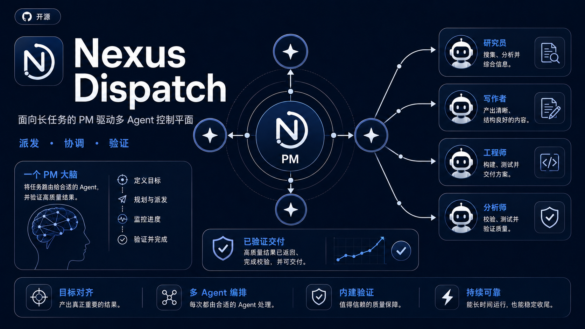
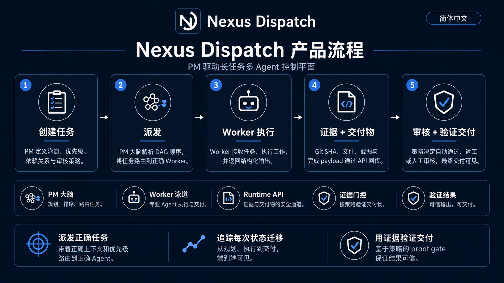
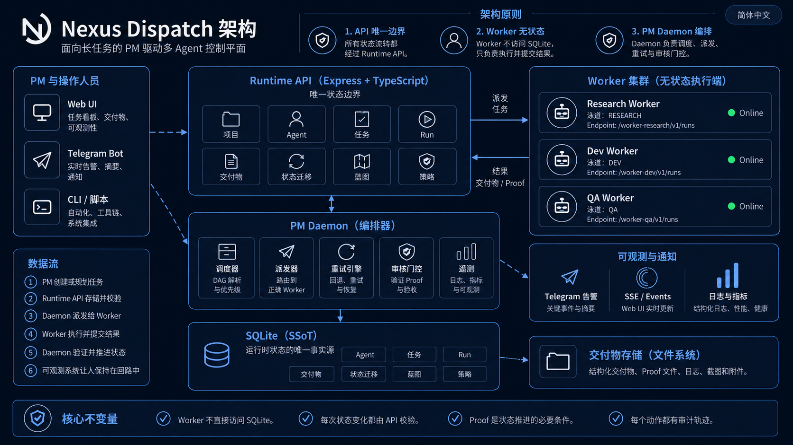

<div align="center">
  <h1>
    
    Nexus Dispatch
  </h1>
  <p><strong>面向长任务的 PM 驱动多 Agent 控制平面。</strong></p>
  <p>
    <a href="./README.md">English</a> ·
    <a href="./README.zh-CN.md">简体中文</a> ·
    <a href="./README.zh-TW.md">繁體中文</a>
  </p>
</div>

<p align="center">
  
  
  
  
  
</p>

<p align="center">
  
</p>

---

> 面向独立 AI Worker 的 PM 控制平面。Nexus Dispatch 负责派发任务，通过状态机 Runtime 追踪每次状态流转，并以结构化证据门控验证完成——无人值守、全程可观察、可审计。

---

## 它是什么 / 它不是什么

| ✅ 它是什么 | ❌ 它不是什么 |
| --- | --- |
| 协调 AI Agent 的**控制平面** | 通用 Agent 框架 |
| 负责派发、追踪、验证的 **PM 大脑** | 聊天式任务机器人 |
| **API-first**——所有状态走 REST | 共享数据库的自由存取 |
| **单台 VPS、单个 SQLite** 部署 | 分布式 Kubernetes 集群 |
| **Worker 契约驱动**——Agent 是无状态执行器 | Agent 市场或插件系统 |
| **证据门控完成**——必须提交交付物 | 无凭据"标记完成" |

---

## 它做什么

<p align="center">
  
</p>

| 能力 | 结果 | 机制 |
| --- | --- | --- |
| **派发** | 正确的任务到达正确的 Worker。 | DAG 依赖解析、泳道 Lane 路由、优先级评估。无需人工指派。 |
| **追踪** | 每个任务都有可见生命周期。 | FSM 状态流转（`created → dispatched → running → completion_pending → completed`），所有流转通过 Runtime API。 |
| **验证** | 没有证据，就不能完成。 | Run、Artifact、Proof Payload 与 Review Policy 决定交付是否通过。高风险任务走人工审核；常规任务在机器验证后自动推进。 |

---

## 5 分钟 Runtime 冒烟测试

从零启动 Runtime API，并创建一个可派发任务。

> **说明：** 本冒烟测试仅启动 Runtime API 并创建可派发任务。不包含模拟 Worker——任务完成需要真实的 Worker 端点。

### 前置条件

- Node.js 18+
- Docker & Docker Compose（容器化部署）或裸机 VPS

### 第 1 步 — 克隆与配置（1 分钟）

```bash
git clone https://github.com/zcweah1981/Nexus-Dispatch.git
cd Nexus-Dispatch
cp .env.example .env
# 编辑 .env — 设置 YOUR_RUNTIME_TOKEN 和项目参数。绝不要提交 .env。
```

### 第 2 步 — 启动（1 分钟）

```bash
docker compose up -d --build

# 验证：无认证请求应返回 401
curl -i "http://localhost:8000/api/v1/runtime/tasks/pending?project_id=nexus-dispatch"

# 验证：已认证请求应返回 JSON
curl -sS \
  -H "Authorization: Bearer YOUR_RUNTIME_TOKEN" \
  "http://localhost:8000/api/v1/runtime/tasks/pending?project_id=nexus-dispatch"
```

### 第 3 步 — 注册 Worker（1 分钟）

```bash
curl -sS -X POST \
  "http://localhost:8000/api/v1/runtime/projects/nexus-dispatch/agents" \
  -H "Authorization: Bearer YOUR_RUNTIME_TOKEN" \
  -H "Content-Type: application/json" \
  -d '{
    "agent_id": "my-worker-1",
    "endpoint": "http://worker-host:8647/v1/runs",
    "lane": "DEV",
    "dialect": "openclaw",
    "soul_prompt": "Execute assigned DEV tasks and return structured proof.",
    "tools_allowed": ["terminal", "file", "web"],
    "status": "online"
  }'
```

### 第 4 步 — 派发任务（1 分钟）

```bash
curl -sS -X POST \
  "http://localhost:8000/api/v1/runtime/tasks" \
  -H "Authorization: Bearer YOUR_RUNTIME_TOKEN" \
  -H "Content-Type: application/json" \
  -d '{
    "project_id": "nexus-dispatch",
    "title": "部署冒烟任务",
    "objective": "验证 Runtime API 可以创建并派发任务。",
    "lane_required": "DEV",
    "acceptance_criteria": ["Runtime API 返回 task 对象", "Worker 收到派发"],
    "acceptance_mode": "group_only",
    "max_retries": 1
  }'
```

### 第 5 步 — 观察（1 分钟）

- **WebUI：** 打开 `http://localhost:3030`——任务出现、被派发，全程可见。
- **Telegram：** 如果已配置，Agent 的 bot 会发布人类可读的摘要——无内部 ID、无原始 JSON。

👉 **完整部署指南、systemd 配置和故障排查：** [docs/install.zh-CN.md](./docs/install.zh-CN.md)

---

## Worker 契约

Worker 通过简单的 HTTP 契约与 Nexus Dispatch 交互。无需 SDK。

- 注册项目级 Worker endpoint 与泳道。
- 接收 PM Daemon 派发的任务 payload。
- 通过 Runtime API 提交 Run、Artifact 与状态迁移 proof。
- 绝不直接访问 SQLite、做调度决策或自行标记任务完成。

👉 完整接入细节：[docs/worker-contract.md](./docs/worker-contract.md)

---

## 核心概念

| 术语 | 定义 |
| --- | --- |
| **PM 大脑** | 唯一的调度权威。解析 DAG、评估优先级、门控审核。实现为无头 Daemon Tick Loop。 |
| **Worker** | 无状态执行器。认领任务、执行、提交证据。不做调度决策。 |
| **泳道 Lane** | Worker 的专业方向：`DEV`、`DESIGN`、`OPS`、`CONTENT`。任务声明所需泳道。 |
| **方言 (Dialect)** | Daemon 与 Worker 的通信协议：`hermes`（Telegram 原生）或 `openclaw`（HTTP Webhook）。 |
| **FSM** | 有限状态机，管理任务生命周期。任何 Agent 都不能跳过状态或自行标记完成。 |
| **证据门控 (Proof Gate)** | 完成门控，要求结构化交付物。类型：`repo_proof`、`run_proof`、`review_proof`、`report_proof`、`ops_proof`。 |
| **审核策略 (Review Policy)** | 任务审核的路由规则：`pm_audit_immediate`（人工门控）或 `group_only`（机器证据解锁下游）。 |
| **蓝图 (Blueprint)** | 冻结的项目计划。按阶段门控：冻结 → 解冻下一阶段 → 推进里程碑。 |
| **SSoT** | 单一真相源。SQLite 仅在 API Server 进程内可见，外部无任何访问途径。 |

---

## 工作流全景



1. **创建任务** — PM 定义泳道、优先级、依赖关系与审核策略。
2. **派发执行** — PM 大脑解析 DAG 顺序，并把 Run 路由到正确的 Worker 泳道。
3. **Worker 执行** — Worker 认领任务、执行工作，并返回结构化结果。
4. **Proof 与交付物** — Git SHA、文件、图片与完成 payload 统一通过 Runtime API 回流。
5. **审核与验证交付** — 策略决定自动通过、返工或人工审核，最后生成可见交付。

---

## 架构



核心不变量：

1. **Runtime API 是唯一状态边界。** 所有读写通过 REST，SQLite 仅在 API Server 进程内部可见。
2. **Worker 是无状态执行端。** 接收派发、执行、提交证据，绝不直接访问 SQLite 或做调度决策。
3. **PM Daemon 负责调度、派发、重试和审核门控。** 任何 Agent 不能自行认领或自行标记完成。

---

## 安全模型

Nexus Dispatch 围绕清晰的 Runtime 边界设计：

- 所有状态流转必须经过 Runtime API。
- Worker 绝不直接访问 SQLite。
- 每个 `/api/v1/runtime/*` 请求都需要 Bearer Token。
- Worker 的输出必须以 Run、Artifact、Proof Payload 的形式提交。
- Telegram 消息只包含人类可读摘要，不暴露原始密钥或内部 payload。
- 公开部署应启用 HTTPS，并确保 `.env` 不进入版本库。

---

## 文档导航

| 指南 | 说明 |
| --- | --- |
| [部署指南](./docs/install.zh-CN.md) | Docker、systemd、冒烟测试 |
| [Worker 接入](./docs/worker-contract.md) | 注册 Worker、接收派发、提交 Artifact |
| [Runtime API](./docs/runtime-api.md) | Tasks、Runs、Artifacts、Transitions、Review Policies |
| [架构说明](./docs/architecture.md) | Runtime 边界、Daemon、Worker 集群、SQLite SSoT |

---

## 项目状态

| | 状态 |
| --- | --- |
| **阶段** | V8 Clean Rebuild（R0–R9） |
| **当前** | 活跃开发中——控制平面 MVP |
| **稳定能力** | Schema + Prisma DAL · Runtime API + FSM Controller · Daemon / Dispatcher · Review / Acceptance · Completion Reports · Telegram 通知 |
| **进行中** | WebUI 重建 · Project Cron Registry · E2E Release Candidate |
| **当前推荐** | 个人多 Agent 编排、内部自动化、单 VPS 控制平面 |
| **暂不推荐** | 公共多租户 SaaS、强监管生产负载、高规模分布式队列替代 |

---

## 验证命令

```bash
npm run build              # TypeScript 编译
npm test                   # Jest 测试套件
npm run validate:api-deploy # 路由边界与部署验证
```

---

## 许可证

本项目基于 [MIT 许可证](./LICENSE) 开源。

Copyright (c) 2026 Nexus Dispatch contributors
