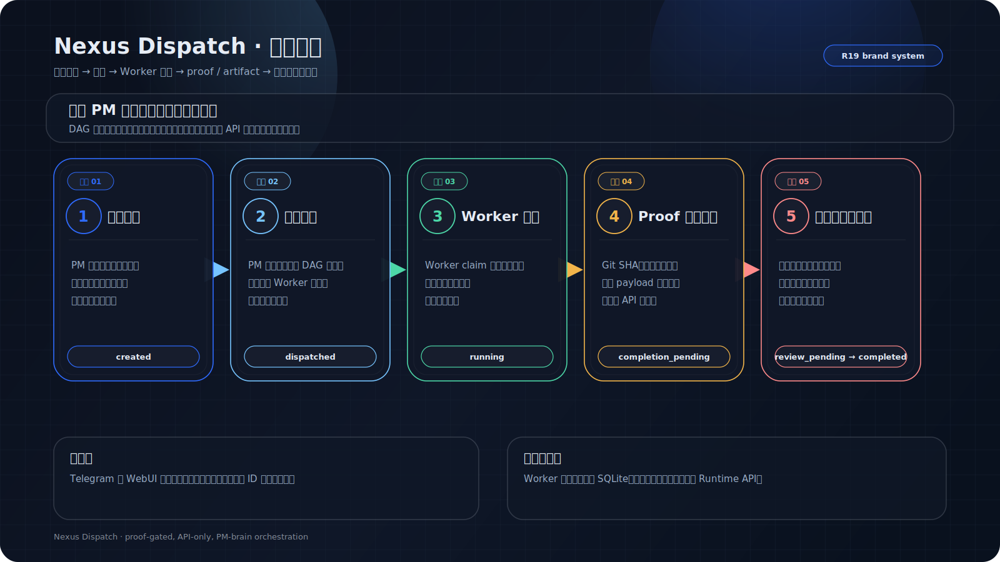
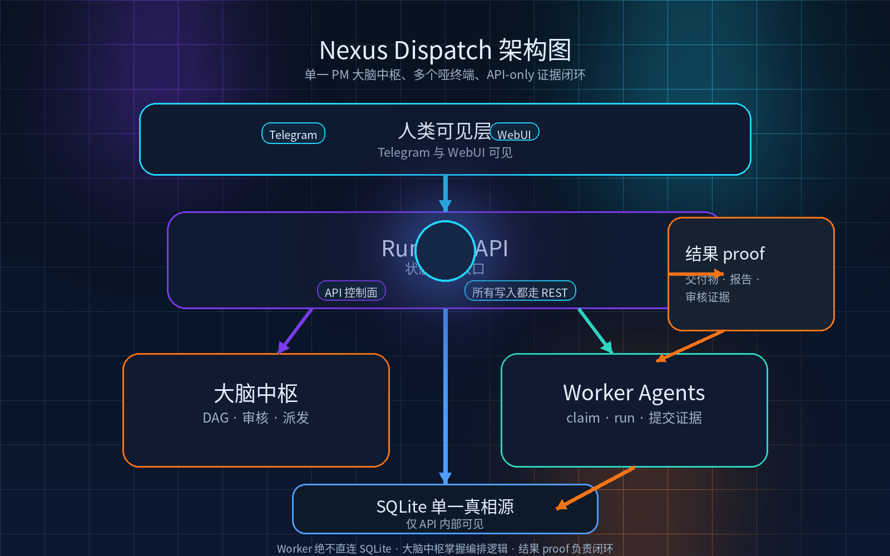
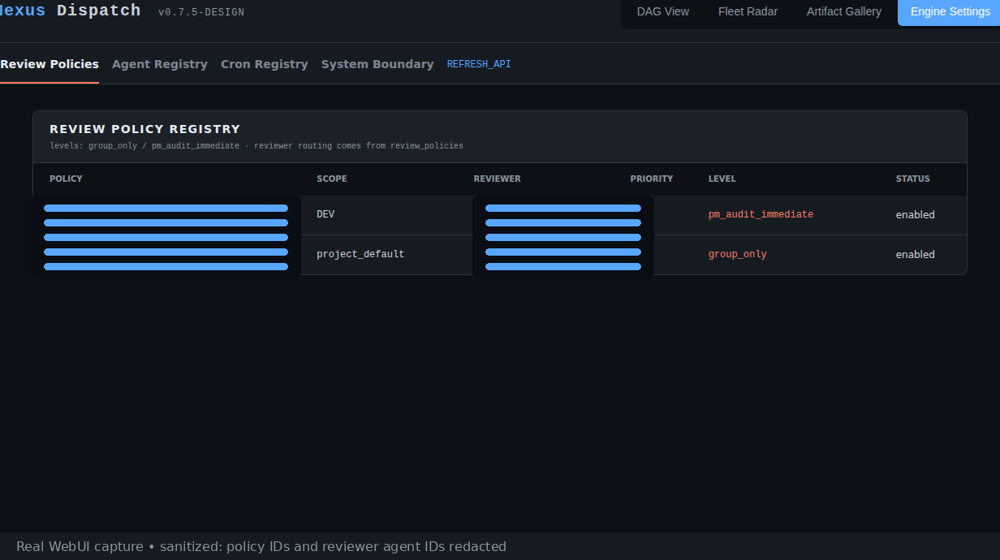

<div align="center">
  
  <br />
  
  <h1>Nexus Dispatch</h1>
  <p><strong>面向长会话任务的 PM 驱动多 Agent 控制平面。</strong></p>
  <p>
    <a href="./README.md">English</a> ·
    <a href="./README.zh-CN.md">简体中文</a> ·
    <a href="./README.zh-TW.md">繁體中文</a>
  </p>
</div>

<p align="center">
  
  
  
  
  
</p>

---

> 一个 PM 大脑中枢向异构 AI Agent 派发任务，通过状态机运行时追踪每次状态流转，并以结构化证据门控验证完成——全程无人值守、全程可观察、零信任闭环。

---

## 它做什么

Nexus Dispatch 只做三件事——并且做好：

| | 做什么 | 怎么做 |
| --- | --- | --- |
| 📤 **派发** | 在正确的时间把正确的任务派给正确的 Agent。 | DAG 依赖解析、泳道路由、优先级评估。无需人工指派。 |
| 📡 **追踪** | 随时知道每个任务在哪一步。 | FSM 驱动的生命周期（`created → dispatched → running → completion_pending → completed`）。每次流转走 REST API。 |
| ✅ **验证** | 证据不过门控，就不算"完成"。 | Worker 提交结构化交付物（Git SHA、文件哈希、截图）。高风险任务走人工审核；常规任务在机器验证后自动推进。 |

---

## 它是什么 / 它不是什么

| ✅ 它是什么 | ❌ 它不是什么 |
| --- | --- |
| 协调 AI Agent 的**控制平面** | 通用 Agent 框架 |
| 负责派发、追踪、验证的 **PM 大脑** | 聊天式任务机器人 |
| **API-first**——所有状态走 REST | 共享数据库的自由存取 |
| **单台 VPS、单个 SQLite** 部署 | 分布式 Kubernetes 集群 |
| **Worker 契约驱动**——Agent 是无状态执行器 | Agent 市场或插件系统 |
| **证据门控完成**——必须提交交付物 | 无凭据"标记完成" |

---

## 核心概念

| 术语 | 定义 |
| --- | --- |
| **PM 大脑** | 唯一的调度权威。解析 DAG、评估优先级、门控审核。实现为无头 Daemon Tick Loop。 |
| **Worker** | 无状态执行器。认领任务、执行、提交证据。不做调度决策。 |
| **泳道 (Lane)** | Worker 的专业方向：`DEV`、`DESIGN`、`OPS`、`CONTENT`。任务声明所需泳道。 |
| **方言 (Dialect)** | Daemon 与 Worker 的通信协议：`hermes`（Telegram 原生）或 `openclaw`（HTTP Webhook）。 |
| **FSM** | 有限状态机，管理任务生命周期。任何 Agent 都不能跳过状态或自行标记完成。 |
| **证据门控 (Proof Gate)** | 完成门控，要求结构化交付物。类型：`repo_proof`、`run_proof`、`review_proof`、`report_proof`、`ops_proof`。 |
| **审核策略 (Review Policy)** | 任务审核的路由规则：`pm_audit_immediate`（人工门控）或 `group_only`（机器证据解锁下游）。 |
| **蓝图 (Blueprint)** | 冻结的项目计划。按阶段门控：冻结 → 解冻下一阶段 → 推进里程碑。 |
| **SSoT** | 单一真相源。SQLite 仅在 API Server 进程内可见，外部无任何访问途径。 |

---

## 工作流全景



1. **PM 创建任务**，指定泳道、依赖和审核策略。
2. **PM 大脑派发**到对应的专业 Worker。
3. **Worker 执行并提交证据**——交付物通过同一 API 边界回传。
4. **审核门控裁决**——高风险任务需要人工审核；常规任务在机器验证后自动推进。
5. **Telegram + WebUI 展示结果**——人类可读，不暴露内部 ID。

---

## 架构



```
┌─────────────────────────────────────────────────────────┐
│                     人类层                               │
│  Telegram (每 Agent 独立 bot)  ·  WebUI (只读 SSE)       │
└──────────┬──────────────────────────┬───────────────────┘
           │ 通知                      │ 可观测
           ▼                          ▼
┌─────────────────────────────────────────────────────────┐
│              Runtime API (Express :8000)                 │
│  ┌─────────┐ ┌──────────┐ ┌──────────┐ ┌────────────┐  │
│  │ Tasks   │ │ Runs     │ │ Reports  │ │ Blueprints │  │
│  │ Agents  │ │ Cronjobs │ │ Artifacts│ │ Review     │  │
│  └─────────┘ └──────────┘ └──────────┘ └────────────┘  │
│              Bearer Token Auth · /api/v1/runtime/*       │
└──────────┬──────────────────────────────────┬───────────┘
           │ Tick Loop                        │ 注册
           ▼                                  ▼
┌────────────────────┐            ┌───────────────────────┐
│  PM Daemon         │  派发      │  Worker Agents        │
│  · DAG 解析        │ ────────▶  │  · claim → run        │
│  · 优先级评估      │  ◀──────── │  · 提交证据           │
│  · 审核门控        │  交付物    │  · POST 结果          │
└────────────────────┘            └───────────────────────┘
           │
           ▼
┌────────────────────┐
│  SQLite (SSoT)     │  ← 仅 API 进程内部可见
│  Prisma DAL        │    外部无任何访问途径
└────────────────────┘
```

**核心不变量：** SQLite 仅在 API Server 进程内可见。Worker、Daemon 和 WebUI 绝不直接操作数据库。

---

## 真实使用截图



---

## 5 分钟快速上手

从零到一个已派发的任务，5 分钟内搞定。

### 前置条件

- Node.js 18+
- Docker & Docker Compose（容器化部署）或裸机 VPS

### 第 1 步 — 克隆与配置（1 分钟）

```bash
git clone https://github.com/zcweah1981/Nexus-Dispatch.git
cd Nexus-Dispatch
cp .env.example .env
# 编辑 .env — 设置 API_AUTH_TOKEN 和项目参数。绝不要提交 .env。
```

### 第 2 步 — 启动（1 分钟）

```bash
docker compose up -d --build

# 验证：无认证请求应返回 401
curl -i "http://localhost:8000/api/v1/runtime/tasks/pending?project_id=nexus-dispatch"

# 验证：已认证请求应返回 JSON
curl -sS \
  -H "Authorization: Bearer $API_AUTH_TOKEN" \
  "http://localhost:8000/api/v1/runtime/tasks/pending?project_id=nexus-dispatch"
```

### 第 3 步 — 注册 Worker（1 分钟）

```bash
curl -sS -X POST \
  "http://localhost:8000/api/v1/runtime/projects/nexus-dispatch/agents" \
  -H "Authorization: Bearer $API_AUTH_TOKEN" \
  -H "Content-Type: application/json" \
  -d '{
    "agent_id": "my-worker-1",
    "endpoint": "http://worker-host:8647/v1/runs",
    "lane": "DEV",
    "dialect": "openclaw",
    "soul_prompt": "Execute assigned DEV tasks and return structured proof.",
    "tools_allowed": ["terminal", "file", "web"],
    "status": "online"
  }'
```

### 第 4 步 — 派发任务（1 分钟）

```bash
curl -sS -X POST \
  "http://localhost:8000/api/v1/runtime/tasks" \
  -H "Authorization: Bearer $API_AUTH_TOKEN" \
  -H "Content-Type: application/json" \
  -d '{
    "project_id": "nexus-dispatch",
    "title": "部署冒烟任务",
    "objective": "验证 Runtime API 可以创建并派发任务。",
    "lane_required": "DEV",
    "acceptance_criteria": ["Runtime API 返回 task 对象", "Worker 收到派发"],
    "acceptance_mode": "group_only",
    "max_retries": 1
  }'
```

### 第 5 步 — 观察（1 分钟）

- **WebUI：** 打开 `http://localhost:3030`——任务出现、被派发、完成，全程可见。
- **Telegram：** 如果已配置，Agent 的 bot 会发布人类可读的摘要——无内部 ID、无原始 JSON。

👉 **完整部署指南、systemd 配置和故障排查：** [docs/install.zh-CN.md](./docs/install.zh-CN.md)

---

## Worker 契约

Worker 通过简单的 HTTP 契约与 Nexus Dispatch 交互。无需 SDK。

### 注册

Worker 通过 `POST /api/v1/runtime/projects/:projectId/agents` 注册：

```json
{
  "agent_id": "long-coder-1",
  "endpoint": "http://worker-host:8647/v1/runs",
  "lane": "DEV",
  "dialect": "openclaw",
  "soul_prompt": "Execute assigned DEV tasks only and return structured proof.",
  "tools_allowed": ["terminal", "file", "web"],
  "status": "online"
}
```

### 接收派发

Daemon 向 Worker 的 `endpoint` POST 任务负载：

```json
{
  "task_id": "uuid",
  "project_id": "nexus-dispatch",
  "title": "实现功能 X",
  "objective": "构建功能 X 并通过测试。",
  "lane_required": "DEV",
  "acceptance_criteria": ["功能 X 通过测试", "提供 Git SHA"],
  "acceptance_mode": "group_only",
  "reviewer": "seiya",
  "max_retries": 2
}
```

### 提交证据

Worker 向 `POST /api/v1/runtime/tasks/:taskId/proof` 提交结构化证据：

```json
{
  "run_status": "completed",
  "proof": {
    "repo_proof": { "git_sha": "abc1234", "branch": "feat/x" },
    "run_proof": { "tests_passed": 12, "tests_failed": 0 },
    "summary": "功能 X 已实现，12 个测试全部通过。"
  }
}
```

### 关键规则

- Worker **绝不**直接访问 SQLite——所有交互通过 Runtime API。
- Worker **绝不**做调度决策——PM 大脑拥有所有路由权。
- Worker **必须**提交结构化证据——纯文本"已完成"会被拒绝。
- Worker **可以**在任务间离线——Daemon 按可配置的时间表重试。

---

## 项目状态与推荐使用

| | 状态 |
| --- | --- |
| **阶段** | V8 Clean Rebuild（R0–R9） |
| **当前** | 活跃开发中——控制平面 MVP |
| **稳定能力** | Schema + Prisma DAL · Runtime API + FSM Controller · Daemon / Dispatcher · Review / Acceptance · Completion Reports · Telegram 通知 |
| **进行中** | WebUI 重建 · Project Cron Registry · E2E Release Candidate |

### 推荐使用

- ✅ **最适合：** 运行 3+ 异构 AI Agent 处理长任务（编码、设计、内容、运维）的团队，需要 PM 大脑协调派发、追踪进度、验证交付。
- ✅ **最适合：** 个人开发者想要发射后不管的多 Agent 工作流，无需从零搭建编排系统。
- ⚠️ **尚未准备好：** 多租户 SaaS、K8s 自动伸缩或 Agent 市场场景。

---

## 安全边界

- **仓库不含真实密钥。** README、docker-compose 和 systemd 示例均使用 `$VARIABLE` 占位符。从 `.env.example` 复制后在本地填写。
- **API-only 数据访问。** SQLite 仅在 API Server 内部可见。任何模块、Worker 或 UI 都不直接访问数据库。
- **每次请求 Bearer Token。** 所有 `/api/v1/*` 端点都需要 `Authorization: Bearer <token>`。无认证请求返回 `401`。
- **每 Agent 独立 Telegram Bot。** 每个 Agent 用自己的 bot token 发送通知。无共享 bot，凭据不泄露到群聊。
- **聊天不含敏感 ID。** Task、Run、Dispatch 和 Trace ID 留在数据库和 Runtime Proof 中。群聊消息仅为人类可读的摘要。
- **公网端点必须 TLS。** API 暴露到 localhost 以外时，必须通过反向代理（Nginx、Caddy、Cloudflare Tunnel）强制 HTTPS。

---

## 项目结构

```
Nexus-Dispatch/
├── src/
│   ├── api/           # Express Server，V8 Runtime API 路由
│   ├── daemon/        # PM Daemon Tick Loop
│   ├── dal/           # Prisma 数据访问层
│   └── webui/         # WebUI 仪表盘 (React/Vite)
├── prisma/            # Schema 和迁移
├── tests/             # 单元 + 集成测试 (Jest)
├── scripts/           # health-check.sh，systemd 服务单元
├── docs/
│   ├── install.md     # 完整安装与部署指南（英文）
│   ├── assets/        # Hero 图和架构图 (SVG + PNG)
│   └── v8/            # Runtime Proof 文档和 API 契约
├── docker-compose.yml
├── .env.example
└── README.md          # 英文主文档
```

---

## 文档导航

| 文档 | 说明 |
| --- | --- |
| [docs/install.md](./docs/install.md) | 英文完整部署指南：Docker、systemd、冒烟测试 |
| [docs/install.zh-CN.md](./docs/install.zh-CN.md) | 简体中文部署指南 |
| [docs/install.zh-TW.md](./docs/install.zh-TW.md) | 繁體中文部署導覽 |
| [docs/TRILINGUAL-STRATEGY.md](./docs/TRILINGUAL-STRATEGY.md) | 三语文档策略与命名规则 |
| [docs/v8/](./docs/v8/) | Runtime Proof 文档、API 契约、Schema 规范 |
| [docs/assets/](./docs/assets/) | 产品视觉资产：logo、Hero、工作流全景、架构图 |

---

## 验证命令

```bash
npm run build                                    # 编译 TypeScript
npx prisma validate                              # 校验 Schema
npm test -- --runInBand                          # 运行测试套件
npm --prefix src/webui run build                 # 构建 WebUI
git diff --check                                 # 检查空白问题
npm run validate:api-deploy -- --skip-health     # Prisma + V8 部署检查
./scripts/health-check.sh --quick || true        # 部署健康检查（开发环境 warning 正常）
```

---

## 许可证

本项目基于 [MIT 许可证](./LICENSE) 开源。

Copyright (c) 2026 Nexus Dispatch contributors
