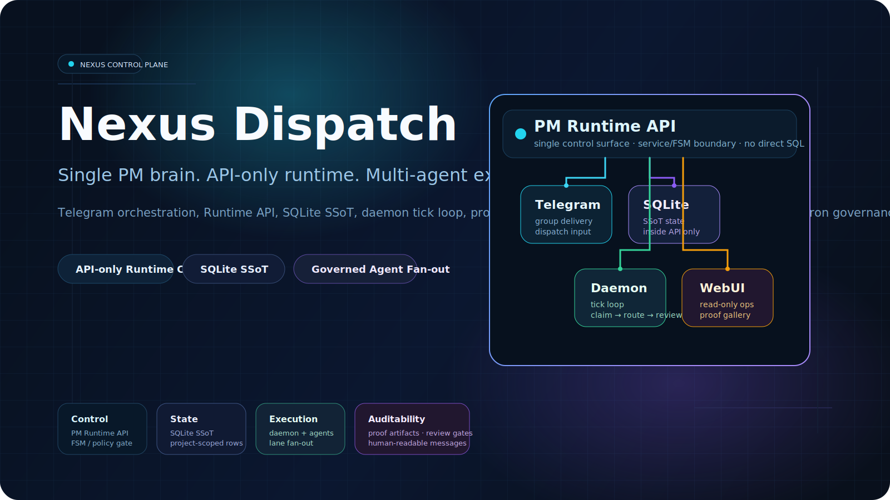
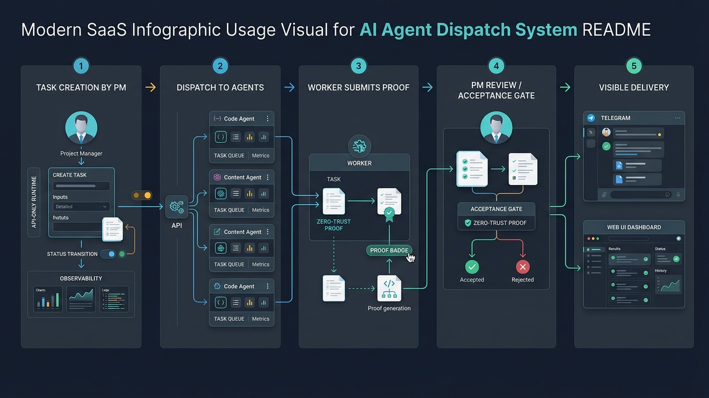

<div align="center">
  
  <h1>Nexus Dispatch</h1>
  <p><strong>一个大脑。多双手。零信任。</strong></p>
  <p>
    <a href="./README.md">English</a> ·
    <a href="./README.zh-TW.md">繁體中文</a>
  </p>
</div>

---

> **多 Agent 编排，终于可控了。**
>
> Nexus Dispatch 是你的 Agent 集群缺失的那个控制平面——一个单一 PM 大脑来派单、追踪、验收跨任意数量异构 AI Agent 的工作。底层基于 API-only、状态机驱动的运行时，永不信任 Worker 自证完成。

<p align="center">
  
  
  
  
  
  
  
  
</p>

---

## 问题是什么？

你有 5 个、10 个甚至 50 个 AI Agent，但没有一个大脑在协调。任务丢失、重复、或者"完成了"却没有证据。聊天频道淹没在噪音里。没人能回答一个基本问题：*到底上线了什么？验证过了吗？*

Nexus Dispatch 解决这个问题。它不是又一个聊天机器人框架或 Agent 工具箱——它是**任务控制中心**，坐在所有 Agent 上方，确保正确的工作到达正确的 Agent，被执行、被验证、被追踪。每次如此。

---

## 适合谁？

| 角色 | 用法 |
| --- | --- |
| **AI Agent 团队** | 按泳道路由和并发控制，向编码、设计、内容、审核 Agent 派发任务。 |
| **技术负责人** | 通过 WebUI + SSE 监控任务全生命周期——从派单到审核到交付物验收。 |
| **多 Agent 单人开发者** | 运行一个轻量 PM Daemon，让多 Agent 工作流保持诚实，无需从零搭建编排系统。 |
| **运维 & 平台团队** | 单台 VPS 上用 Docker Compose 或 systemd 部署。SQLite SSoT 意味着无需外部数据库。 |

---

## 为什么选择 Nexus Dispatch？

| 你能得到什么 | 怎么做到的 |
| --- | --- |
| **不再丢任务** | PM Daemon 评估优先级、通过 DAG 解析依赖、按策略派发到正确的 Agent。 |
| **不再有假完成** | Worker 通过 Runtime API 提交 proof、run 和 artifact。状态机说"完成"才算完成。 |
| **不共享数据库** | 每次状态流转走 REST。无 SSH 隧道，无 Agent 直连 DB。 |
| **不泄露凭据** | Telegram 通知由每个 Agent 自己的 bot 发出，Daemon 不代发。追踪 ID 留在数据库，不进聊天。 |
| **不复杂部署** | 单台 VPS，Docker Compose 或裸机。一个 SQLite 文件。零外部依赖。 |

---

## 架构


```
┌─────────────────────────────────────────────────────────┐
│                     人类层                               │
│  Telegram (每 Agent 独立 bot)  ·  WebUI (只读 SSE)       │
└──────────┬──────────────────────────┬───────────────────┘
           │ 通知                      │ 可观测
           ▼                          ▼
┌─────────────────────────────────────────────────────────┐
│              Runtime API (Express :8000)                 │
│  ┌─────────┐ ┌──────────┐ ┌──────────┐ ┌────────────┐  │
│  │ Tasks   │ │ Runs     │ │ Reports  │ │ Blueprints │  │
│  │ Agents  │ │ Cronjobs │ │ Artifacts│ │ Review     │  │
│  └─────────┘ └──────────┘ └──────────┘ └────────────┘  │
│              Bearer Token Auth · /api/v1/runtime/*       │
└──────────┬──────────────────────────────────┬───────────┘
           │ Tick Loop                        │ 注册
           ▼                                  ▼
┌────────────────────┐            ┌───────────────────────┐
│  PM Daemon         │  派单      │  Worker Agents        │
│  · DAG 解析        │ ────────▶  │  · claim → run        │
│  · 优先级评估      │  ◀──────── │  · 提交 proof         │
│  · 审核门控        │  artifact  │  · POST 结果          │
└────────────────────┘            └───────────────────────┘
           │
           ▼
┌────────────────────┐
│  SQLite (SSoT)     │  ← 仅 API 进程内部可见
│  Prisma DAL        │    外部无任何访问途径
└────────────────────┘
```

**核心不变量：** SQLite 仅在 API Server 进程内可见。Worker、Daemon 和 WebUI 绝不直接操作数据库——全部通过 Runtime API 访问。

---

## 核心能力

### 🔄 状态机驱动的任务生命周期

每个任务严格遵循有限状态机：`created → dispatched → running → completion_pending → review_pending → completed`，并包含 retry、blocked、dead_letter 和 cancelled 分支。没有捷径，任何 Agent 都不能跳过状态或自行标记"已完成"。

### 🔗 DAG 依赖解析

任务声明依赖关系。Daemon 的 DAG 引擎执行拓扑排序并检测环路——循环依赖在派单前就被拦截，而不是挂起后才暴露。

### 🛡️ 动态审核门控

任务携带 `review_policy`（`group_only`、`pm_audit` 等）。高风险任务需要审核人 proof 后才能解锁下游。常规任务在机器验证 artifact 提交后自动推进。

### 📋 蓝图 & 阶段管理

冻结项目蓝图、解冻阶段、推进里程碑——全部通过 Runtime API 完成。蓝图 JSON Schema 在冻结时校验，确保每个阶段有明确范围。

### ⏰ Cron Registry 适配器隔离

`project_cronjobs` 是项目级注册表。调度适配器从 API 读取符合条件的 job 并管理外部执行。Daemon 绝不直接启停 cronjob——严格的关注点分离。

### 📨 Telegram 通知（每 Agent 独立 Bot）

每个 Agent 用自己的 bot token 发送通知。Daemon 只从 `AGENT_NOTIFICATIONS` 读取 `bot_token` 与 `chat_id`；可见正文语言来自项目级 Runtime setting `visible_language`（默认 `zh-CN`，支持 `en-US`）。无中心化 bot，无凭据泄露到群聊。

### 📊 WebUI 可观测性

轻量仪表盘读取 API 和 SSE 流。查看任务状态、DAG 阶段进度、artifact 画廊和 run 历史——永远不写数据库。

---

## 运行时模型

Daemon 运行可配置的 Tick Loop（默认 `TICK_INTERVAL`）。每个 tick：

1. **拉取待办任务** — 查询 `/api/v1/runtime/tasks/pending`，按项目和泳道过滤。
2. **解析 DAG** — 拓扑排序 + 环路检测。依赖未满足的任务留在队列。
3. **评估优先级和泳道** — 匹配任务泳道到在线 Agent。遵守每个 Agent 的 `max_concurrency`。
4. **派发** — POST 到 Worker 注册的 `endpoint`。状态流转到 `dispatched`。
5. **等待 proof** — Worker 通过 Runtime API 回传 run、report 和 artifact。
6. **审核门控** — 如果 `review_policy` 要求，创建动态审核任务；否则机器 proof 解锁下游。

```
created → dispatched → running → completion_pending → review_pending → completed
                              ↘ retry_ready / blocked / dead_letter / cancelled
```

### 工作流全景



一次典型的交付路径是严格且全程可见的：

1. **PM 创建任务**，指定泳道、依赖和审核策略。
2. **Daemon 派发**到对应的专业 Worker。
3. **Worker 提交 proof** — run、artifact 和完成负载通过同一个 API 边界回传。
4. **PM / 审核门控**根据策略和 proof 质量决定通过或打回。
5. **Telegram + WebUI 展示结果**，以人类可读的形式呈现，不暴露内部 ID 或敏感信息。

---

## 快速开始

### 前置条件

- Node.js 18+
- Docker & Docker Compose（容器化部署）或裸机 VPS

### Docker Compose（推荐）

```bash
git clone https://github.com/zcweah1981/Nexus-Dispatch.git
cd Nexus-Dispatch
cp .env.example .env
# 编辑 .env — 设置 API_AUTH_TOKEN 和项目参数。绝不要提交 .env。

docker compose up -d --build

# 验证：无认证请求应返回 401
curl -i "http://localhost:8000/api/v1/runtime/tasks/pending?project_id=nexus-dispatch"

# 验证：已认证请求应返回 JSON
curl -sS \
  -H "Authorization: Bearer $API_AUTH_TOKEN" \
  "http://localhost:8000/api/v1/runtime/tasks/pending?project_id=nexus-dispatch"
```

### 本地开发

```bash
npm install
cp .env.example .env
npx prisma generate
npx prisma migrate deploy
npm run build
npm start        # API server 运行在 :8000

# 另一个终端：
npm run daemon   # PM Daemon Tick Loop

# WebUI（可选）：
npm --prefix src/webui install
npm --prefix src/webui run dev
```

### 注册你的第一个 Worker

```bash
curl -sS -X POST \
  "http://localhost:8000/api/v1/runtime/projects/nexus-dispatch/agents" \
  -H "Authorization: Bearer $API_AUTH_TOKEN" \
  -H "Content-Type: application/json" \
  -d '{
    "agent_id": "my-worker-1",
    "endpoint": "http://worker-host:8647/v1/runs",
    "lane": "DEV",
    "dialect": "openclaw",
    "max_concurrency": 1,
    "status": "online"
  }'
```

👉 **完整部署指南、systemd 配置和故障排查：** [docs/install.zh-CN.md](./docs/install.zh-CN.md)

---

## 安全边界

Nexus Dispatch 在凭据和数据周围执行严格边界：

- **仓库不含真实密钥。** README、docker-compose 和 systemd 示例均使用 `$VARIABLE` 占位符。从 `.env.example` 复制后在本地填写。
- **API-only 数据访问。** SQLite 仅在 API Server 内部可见。任何模块、Worker 或 UI 都不直接访问 DB。
- **每次请求 Bearer Token。** 所有 `/api/v1/*` 端点要求 `Authorization: Bearer <token>`。未认证请求返回 `401`。
- **每 Agent 独立 Telegram Bot。** 每个 Agent 用自己的 bot token 发送通知。Daemon 从不使用共享 bot 或中心化 token。
- **聊天不含敏感 ID。** Task、Run、Dispatch 和 Trace ID 留在数据库和 Runtime Proof 中。群聊消息仅为人类可读的摘要。
- **公网端点必须 TLS。** API 暴露到 localhost 以外时，必须通过反向代理（Nginx、Caddy、Cloudflare Tunnel）强制 HTTPS。

---

## 项目结构

```
Nexus-Dispatch/
├── src/
│   ├── api/           # Express Server，V8 Runtime API 路由
│   ├── daemon/        # PM Daemon Tick Loop
│   ├── dal/           # Prisma 数据访问层
│   └── webui/         # WebUI 仪表盘 (React/Vite)
├── prisma/            # Schema 和迁移
├── tests/             # 单元 + 集成测试 (Vitest)
├── scripts/           # health-check.sh，systemd 服务单元
├── docs/
│   ├── install.md     # 完整安装与部署指南
│   ├── assets/        # Hero 图和架构图 (SVG + PNG)
│   └── v8/            # Runtime Proof 文档和 API 契约
├── docker-compose.yml
├── .env.example
└── README.md          # 英文主文档
```

---

## 文档导航

| 文档 | 说明 |
| --- | --- |
| [README.md](./README.md) | 英文产品 README（主文档） |
| [docs/install.zh-CN.md](./docs/install.zh-CN.md) | 简体中文部署导览：三语素材说明、架构/部署配图、英文主文档导航 |
| [docs/install.md](./docs/install.md) | 英文完整部署指南：Docker Compose、systemd、冒烟测试、故障排查 |
| [docs/v8/](./docs/v8/) | Runtime Proof 文档、API 契约、Schema 规范 |
| [docs/assets/](./docs/assets/) | 产品视觉资产：Hero、架构图与使用说明图 |
| [docs/assets/guide/](./docs/assets/guide/) | 使用说明配图：部署流程、Hermes/OpenClaw 接入、proof 渲染图 |
| [README.zh-TW.md](./README.zh-TW.md) | 繁體中文入口（佔位，翻譯規劃中） |

---

## 验证命令

```bash
npm run build                                    # 编译 TypeScript
npx prisma validate                              # 校验 Schema
npm test -- --runInBand                          # 运行测试套件
npm --prefix src/webui run build                 # 构建 WebUI
git diff --check                                 # 检查空白问题
./scripts/health-check.sh --quick || true        # 部署健康检查（开发环境 warning 正常）
```

---

## 许可证

本项目基于 [MIT 许可证](./LICENSE) 开源。

Copyright (c) 2026 Nexus Dispatch contributors
