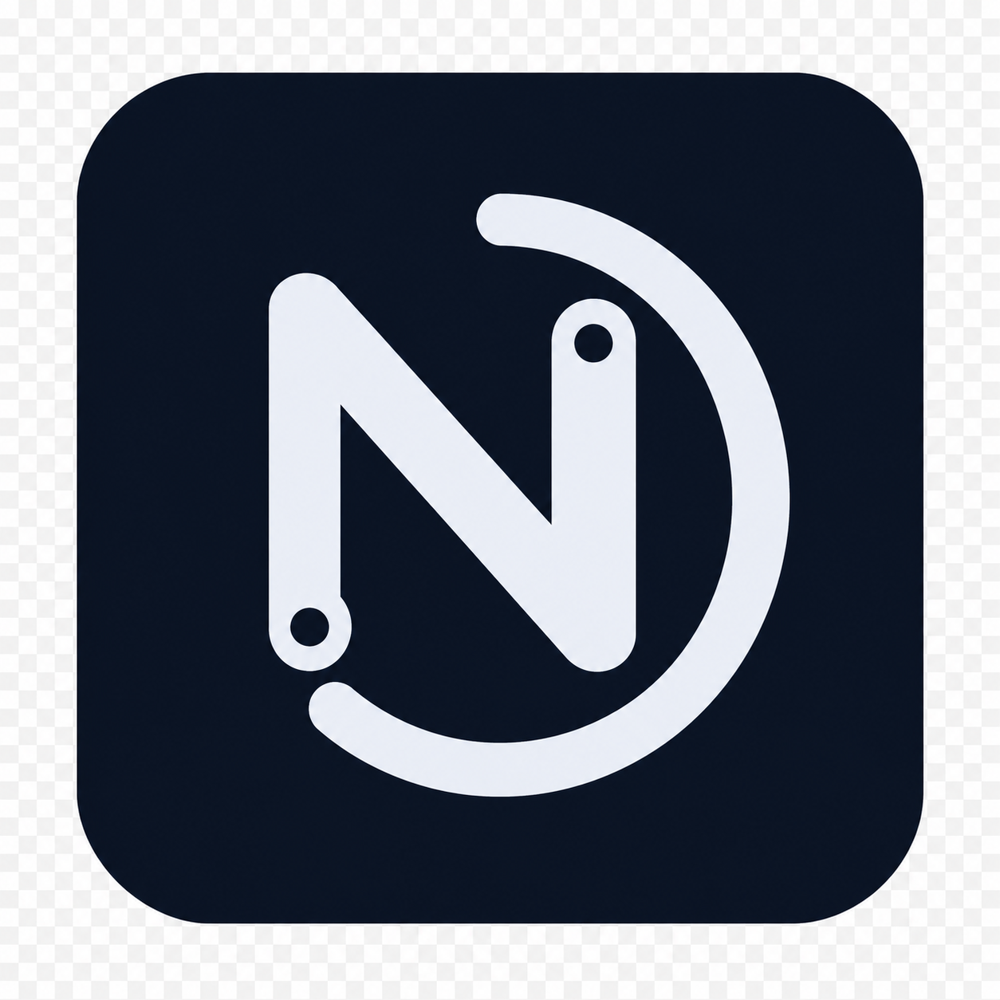
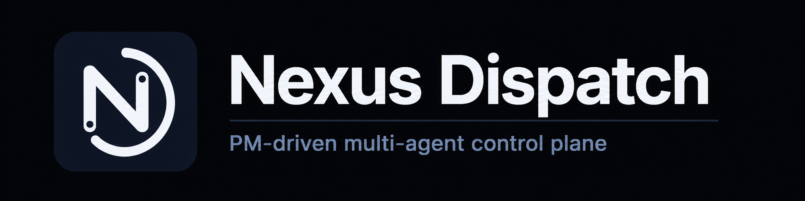
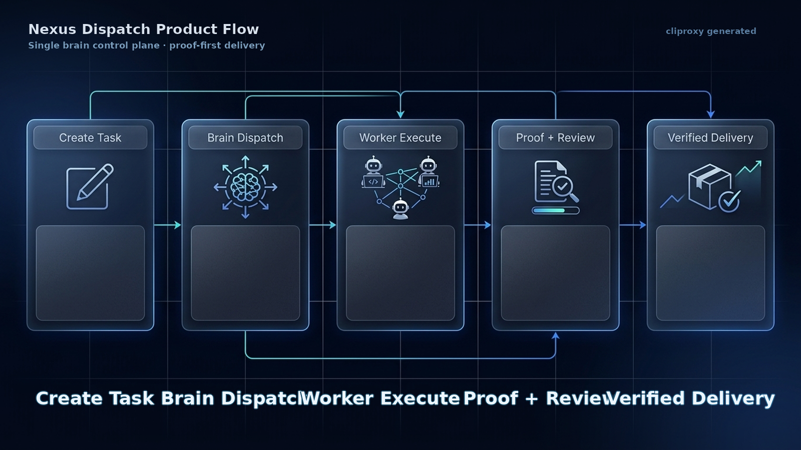
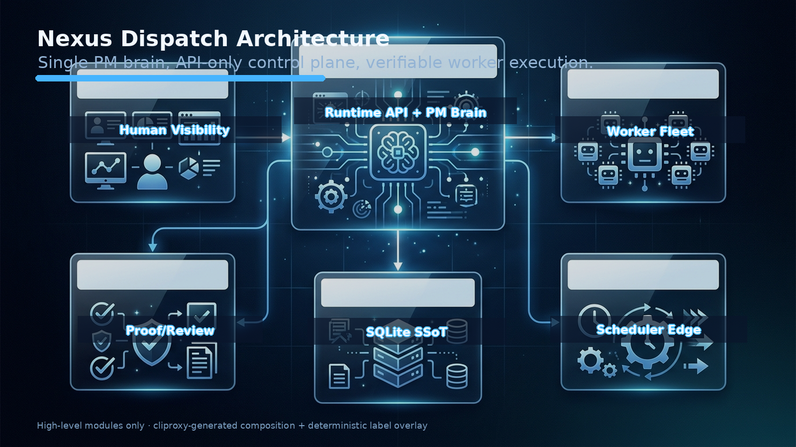

<div align="center">
  <h1>
    
    Nexus Dispatch
  </h1>
  <p><strong>PM-driven multi-agent control plane.</strong></p>
  <p>
    <a href="./README.md">English</a> ·
    <a href="./README.zh-CN.md">简体中文</a> ·
    <a href="./README.zh-TW.md">繁體中文</a>
  </p>
</div>

<p align="center">
  
  
  
  
  
</p>

<p align="center">
  
</p>

---

> 一個 PM 大腦中樞向異構 AI Agent 派發任務，透過狀態機執行時期追蹤每次狀態流轉，並以結構化證據門控驗證完成——全程無人值守、全程可觀察、可審計。

---

## 它是什麼 / 它不是什麼

| ✅ 它是什麼 | ❌ 它不是什麼 |
| --- | --- |
| 協調 AI Agent 的**控制平面** | 通用 Agent 框架 |
| 負責派發、追蹤、驗證的 **PM 大腦** | 聊天式任務機器人 |
| **API-first**——所有狀態走 REST | 共享資料庫的自由存取 |
| **單台 VPS、單個 SQLite** 部署 | 分散式 Kubernetes 叢集 |
| **Worker 契約驅動**——Agent 是無狀態執行器 | Agent 市場或外掛系統 |
| **證據門控完成**——必須提交交付物 | 無憑證「標記完成」 |

---

## 它做什麼

Nexus Dispatch 只做三件事——並且做好：

| | 做什麼 | 怎麼做 |
| --- | --- | --- |
| 📤 **派發** | 在正確的時間把正確的任務派給正確的 Agent。 | DAG 依賴解析、泳道路由、優先級評估。無需人工指派。 |
| 📡 **追蹤** | 隨時知道每個任務在哪一步。 | FSM 驅動的生命週期（`created → dispatched → running → completion_pending → completed`）。每次流轉走 REST API。 |
| ✅ **驗證** | 證據不過門控，就不算「完成」。 | Worker 提交結構化交付物（Git SHA、檔案雜湊、截圖）。高風險任務走人工審核；常規任務在機器驗證後自動推進。 |

---

## 5 分鐘快速上手

從零到一個已派發的任務，5 分鐘內搞定。

### 前置條件

- Node.js 18+
- Docker & Docker Compose（容器化部署）或裸機 VPS

### 第 1 步 — 複製與設定（1 分鐘）

```bash
git clone https://github.com/zcweah1981/Nexus-Dispatch.git
cd Nexus-Dispatch
cp .env.example .env
# 編輯 .env — 設定 API_AUTH_TOKEN 和專案參數。絕不要提交 .env。
```

### 第 2 步 — 啟動（1 分鐘）

```bash
docker compose up -d --build

# 驗證：無認證請求應回傳 401
curl -i "http://localhost:8000/api/v1/runtime/tasks/pending?project_id=nexus-dispatch"

# 驗證：已認證請求應回傳 JSON
curl -sS \
  -H "Authorization: Bearer $API_AUTH_TOKEN" \
  "http://localhost:8000/api/v1/runtime/tasks/pending?project_id=nexus-dispatch"
```

### 第 3 步 — 註冊 Worker（1 分鐘）

```bash
curl -sS -X POST \
  "http://localhost:8000/api/v1/runtime/projects/nexus-dispatch/agents" \
  -H "Authorization: Bearer $API_AUTH_TOKEN" \
  -H "Content-Type: application/json" \
  -d '{
    "agent_id": "my-worker-1",
    "endpoint": "http://worker-host:8647/v1/runs",
    "lane": "DEV",
    "dialect": "openclaw",
    "soul_prompt": "Execute assigned DEV tasks and return structured proof.",
    "tools_allowed": ["terminal", "file", "web"],
    "status": "online"
  }'
```

### 第 4 步 — 派發任務（1 分鐘）

```bash
curl -sS -X POST \
  "http://localhost:8000/api/v1/runtime/tasks" \
  -H "Authorization: Bearer $API_AUTH_TOKEN" \
  -H "Content-Type: application/json" \
  -d '{
    "project_id": "nexus-dispatch",
    "title": "部署冒煙任務",
    "objective": "驗證 Runtime API 可以建立並派發任務。",
    "lane_required": "DEV",
    "acceptance_criteria": ["Runtime API 回傳 task 物件", "Worker 收到派發"],
    "acceptance_mode": "group_only",
    "max_retries": 1
  }'
```

### 第 5 步 — 觀察（1 分鐘）

- **WebUI：** 開啟 `http://localhost:3030`——任務出現、被派發、完成，全程可見。
- **Telegram：** 如果已設定，Agent 的 bot 會發布人類可讀的摘要——無內部 ID、無原始 JSON。

👉 **完整部署指南、systemd 設定和故障排查：** [docs/install.zh-TW.md](./docs/install.zh-TW.md)

---

## Worker 契約

Worker 透過簡單的 HTTP 契約與 Nexus Dispatch 互動。無需 SDK。

### 註冊

Worker 透過 `POST /api/v1/runtime/projects/:projectId/agents` 註冊：

```json
{
  "agent_id": "long-coder-1",
  "endpoint": "http://worker-host:8647/v1/runs",
  "lane": "DEV",
  "dialect": "openclaw",
  "soul_prompt": "Execute assigned DEV tasks only and return structured proof.",
  "tools_allowed": ["terminal", "file", "web"],
  "status": "online"
}
```

### 接收派發

Daemon 向 Worker 的 `endpoint` POST 任務負載：

```json
{
  "task_id": "uuid",
  "project_id": "nexus-dispatch",
  "title": "實作功能 X",
  "objective": "建構功能 X 並通過測試。",
  "lane_required": "DEV",
  "acceptance_criteria": ["功能 X 通過測試", "提供 Git SHA"],
  "acceptance_mode": "group_only",
  "reviewer": "seiya",
  "max_retries": 2
}
```

### 提交證據

Worker 向 `POST /api/v1/runtime/tasks/:taskId/proof` 提交結構化證據：

```json
{
  "run_status": "completed",
  "proof": {
    "repo_proof": { "git_sha": "abc1234", "branch": "feat/x" },
    "run_proof": { "tests_passed": 12, "tests_failed": 0 },
    "summary": "功能 X 已實作，12 個測試全部通過。"
  }
}
```

### 關鍵規則

- Worker **絕不**直接存取 SQLite——所有互動透過 Runtime API。
- Worker **絕不**做排程決策——PM 大腦擁有所有路由權。
- Worker **必須**提交結構化證據——純文字「已完成」會被拒絕。
- Worker **可以**在任務間離線——Daemon 按可設定的排程重試。

---

## 核心概念

| 術語 | 定義 |
| --- | --- |
| **PM 大腦** | 唯一的排程權威。解析 DAG、評估優先級、門控審核。實作為無頭 Daemon Tick Loop。 |
| **Worker** | 無狀態執行器。認領任務、執行、提交證據。不做排程決策。 |
| **泳道 (Lane)** | Worker 的專業方向：`DEV`、`DESIGN`、`OPS`、`CONTENT`。任務聲明所需泳道。 |
| **方言 (Dialect)** | Daemon 與 Worker 的通訊協定：`hermes`（Telegram 原生）或 `openclaw`（HTTP Webhook）。 |
| **FSM** | 有限狀態機，管理任務生命週期。任何 Agent 都不能跳過狀態或自行標記完成。 |
| **證據門控 (Proof Gate)** | 完成門控，要求結構化交付物。類型：`repo_proof`、`run_proof`、`review_proof`、`report_proof`、`ops_proof`。 |
| **審核策略 (Review Policy)** | 任務審核的路由規則：`pm_audit_immediate`（人工門控）或 `group_only`（機器證據解鎖下游）。 |
| **藍圖 (Blueprint)** | 凍結的專案計畫。按階段門控：凍結 → 解凍下一階段 → 推進里程碑。 |
| **SSoT** | 單一真相源。SQLite 僅在 API Server 行程內可見，外部無任何存取途徑。 |

---

## 工作流全景



1. **建立任務** —— PM 定義泳道、優先級、依賴關係與審核策略。
2. **派發執行** —— 大腦中樞解析 DAG 順序，並把 Run 路由到正確的 Worker 泳道。
3. **Worker 執行** —— Worker 認領任務、執行工作，並回傳結構化結果。
4. **Proof 與交付物** —— Git SHA、檔案、圖片與完成 payload 統一透過 Runtime API 回流。
5. **審核與驗證交付** —— 策略決定自動通過、返工或人工審核，最後生成可見交付。

---

## 架構



```
┌─────────────────────────────────────────────────────────┐
│                     人類層                               │
│  Telegram (每 Agent 獨立 bot)  ·  WebUI (唯讀 SSE)       │
└──────────┬──────────────────────────┬───────────────────┘
           │ 通知                      │ 可觀測
           ▼                          ▼
┌─────────────────────────────────────────────────────────┐
│              Runtime API (Express :8000)                 │
│  ┌─────────┐ ┌──────────┐ ┌──────────┐ ┌────────────┐  │
│  │ Tasks   │ │ Runs     │ │ Reports  │ │ Blueprints │  │
│  │ Agents  │ │ Cronjobs │ │ Artifacts│ │ Review     │  │
│  └─────────┘ └──────────┘ └──────────┘ └────────────┘  │
│              Bearer Token Auth · /api/v1/runtime/*       │
└──────────┬──────────────────────────────────┬───────────┘
           │ Tick Loop                        │ 註冊
           ▼                                  ▼
┌────────────────────┐            ┌───────────────────────┐
│  PM Daemon         │  派發      │  Worker Agents        │
│  · DAG 解析        │ ────────▶  │  · claim → run        │
│  · 優先級評估      │  ◀──────── │  · 提交證據           │
│  · 審核門控        │  交付物    │  · POST 結果          │
└────────────────────┘            └───────────────────────┘
           │
           ▼
┌────────────────────┐
│  SQLite (SSoT)     │  ← 僅 API 行程內部可見
│  Prisma DAL        │    外部無任何存取途徑
└────────────────────┘
```

**核心不變量：** SQLite 僅在 API Server 行程內可見。Worker、Daemon 和 WebUI 絕不直接操作資料庫。

---

## 文件導航

| 文件 | 說明 |
| --- | --- |
| [docs/install.md](./docs/install.md) | 英文完整部署指南：Docker、systemd、冒煙測試 |
| [docs/install.zh-CN.md](./docs/install.zh-CN.md) | 簡體中文部署指南 |
| [docs/install.zh-TW.md](./docs/install.zh-TW.md) | 繁體中文部署導覽 |
| [docs/TRILINGUAL-STRATEGY.md](./docs/TRILINGUAL-STRATEGY.md) | 三語文件策略與命名規範 |
| [docs/v8/](./docs/v8/) | Runtime Proof 文件、API 契約、Schema 規範 |
| [docs/assets/](./docs/assets/) | 產品視覺資產：logo、banner、工作流全景、架構圖 |

---

## 專案狀態

| | 狀態 |
| --- | --- |
| **階段** | V8 Clean Rebuild（R0–R9） |
| **當前** | 活躍開發中——控制平面 MVP |
| **穩定能力** | Schema + Prisma DAL · Runtime API + FSM Controller · Daemon / Dispatcher · Review / Acceptance · Completion Reports · Telegram 通知 |
| **進行中** | WebUI 重建 · Project Cron Registry · E2E Release Candidate |

### 推薦使用

- ✅ **最適合：** 運行 3+ 異構 AI Agent 處理長任務（編碼、設計、內容、維運）的團隊，需要 PM 大腦協調派發、追蹤進度、驗證交付。
- ✅ **最適合：** 個人開發者想要發射後不管的多 Agent 工作流，無需從零搭建編排系統。
- ⚠️ **尚未準備好：** 多租戶 SaaS、K8s 自動伸縮或 Agent 市場場景。

---

## 授權

本專案基於 [MIT 授權條款](./LICENSE) 開源。

Copyright (c) 2026 Nexus Dispatch contributors
