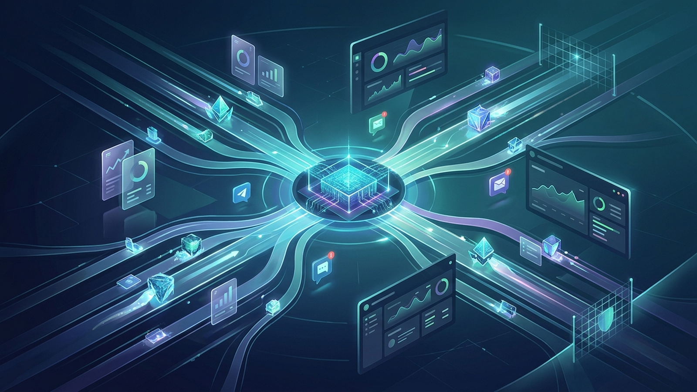

  
  <h1>Nexus Dispatch</h1>
  
<strong>一個大腦。多雙手。零信任。</strong>

  

    <a href="./README.md">English</a> ·
    <a href="./README.zh-CN.md">簡體中文</a>
  

---

  
  
  
  
  
  
  
  

---

> ⚠️ **繁體中文版本目前為佔位入口頁面。**
>
> 完整繁體中文翻譯尚在規劃中，目前請參考以下版本：
> - **English**: [README.md](./README.md) （主要維護版本）
> - **簡體中文**: [README.zh-CN.md](./README.zh-CN.md) （同步維護版本）
>
> 繁體中文翻譯將在後續版本中提供。如需優先處理，請提交 Issue。

---

## 專案簡介

Nexus Dispatch 是一個多 Agent 編排控制平面——用單一 PM 大腦來派單、追蹤、驗收跨任意數量異構 AI Agent 的工作。底層基於 API-only、SQLite 驅動、狀態機控制的運行時，永遠不信任 Worker 自證完成。

### 核心能力

- **🔄 狀態機驅動的任務生命週期** — `created → dispatched → running → completion_pending → review_pending → completed`
- **🔗 DAG 依賴解析** — 拓撲排序 + 環路偵測
- **🛡️ 動態審核門控** — `review_policy` 控制高風險任務審核流程
- **📋 藍圖 & 階段管理** — 凍結、解凍、推進里程碑
- **⏰ Cron Registry 適配器隔離** — 嚴格的關注點分離
- **📨 Telegram 通知（每 Agent 獨立 Bot）** — Daemon 不代發
- **📊 WebUI 可觀測性** — 輕量儀表盤，只讀不寫

## 快速開始

請參閱 [English README](./README.md) 的 Quick Start 章節，或查看 [安裝部署指南](./docs/install.zh-TW.md)。

## 文件導航

- [English README](./README.md)
- [簡體中文 README](./README.zh-CN.md)
- [繁體中文安裝導覽](./docs/install.zh-TW.md)
- [English Install Guide](./docs/install.md)

## 授權

本專案基於 [MIT 授權條款](./LICENSE) 開源。

Copyright (c) 2026 Nexus Dispatch contributors
