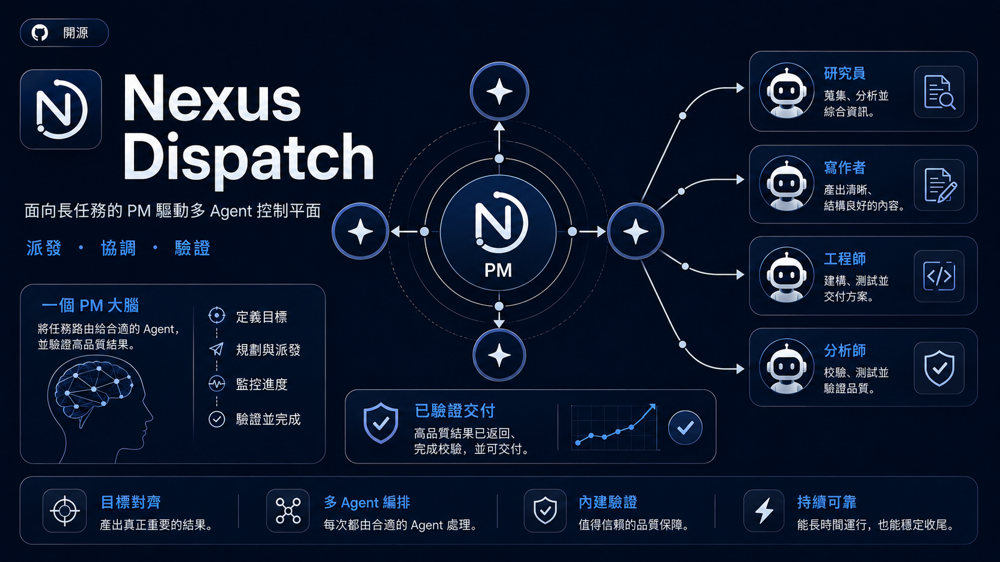
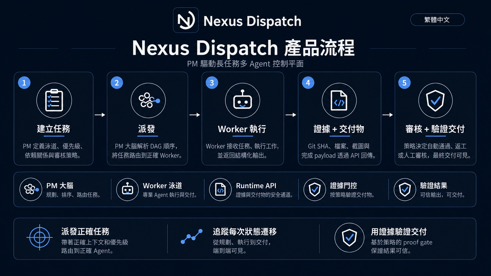
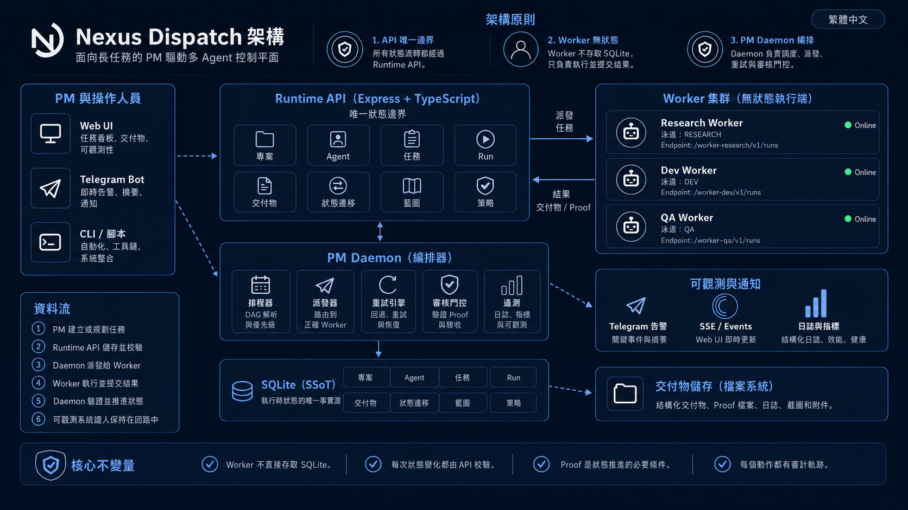

<div align="center">
  <h1>
    
    Nexus Dispatch
  </h1>
  <p><strong>面向長任務的 PM 驅動多 Agent 控制平面。</strong></p>
  <p>
    <a href="./README.md">English</a> ·
    <a href="./README.zh-CN.md">简体中文</a> ·
    <a href="./README.zh-TW.md">繁體中文</a>
  </p>
</div>

<p align="center">
  
  
  
  
  
</p>

<p align="center">
  
</p>

---

> 面向獨立 AI Worker 的 PM 控制平面。Nexus Dispatch 負責派發任務，透過狀態機 Runtime 追蹤每次狀態流轉，並以結構化證據門控驗證完成——無人值守、全程可觀察、可審計。

---

## 它是什麼 / 它不是什麼

| ✅ 它是什麼 | ❌ 它不是什麼 |
| --- | --- |
| 協調 AI Agent 的**控制平面** | 通用 Agent 框架 |
| 負責派發、追蹤、驗證的 **PM 大腦** | 聊天式任務機器人 |
| **API-first**——所有狀態走 REST | 共享資料庫的自由存取 |
| **單台 VPS、單個 SQLite** 部署 | 分散式 Kubernetes 叢集 |
| **Worker 契約驅動**——Agent 是無狀態執行器 | Agent 市場或外掛系統 |
| **證據門控完成**——必須提交交付物 | 無憑證「標記完成」 |

---

## 它做什麼

<p align="center">
  
</p>

| 能力 | 結果 | 機制 |
| --- | --- | --- |
| **派發** | 正確的任務到達正確的 Worker。 | DAG 依賴解析、泳道 Lane 路由、優先級評估。無需人工指派。 |
| **追蹤** | 每個任務都有可見生命週期。 | FSM 狀態流轉（`created → dispatched → running → completion_pending → completed`），所有流轉透過 Runtime API。 |
| **驗證** | 沒有證據，就不能完成。 | Run、Artifact、Proof Payload 與 Review Policy 決定交付是否通過。高風險任務走人工審核；常規任務在機器驗證後自動推進。 |

---

## 5 分鐘 Runtime 冒煙測試

從零啟動 Runtime API，並建立一個可派發任務。

> **說明：** 本冒煙測試僅啟動 Runtime API 並建立可派發任務。不包含模擬 Worker——任務完成需要真實的 Worker 端點。

### 前置條件

- Node.js 18+
- Docker & Docker Compose（容器化部署）或裸機 VPS

### 第 1 步 — 複製與設定（1 分鐘）

```bash
git clone https://github.com/zcweah1981/Nexus-Dispatch.git
cd Nexus-Dispatch
cp .env.example .env
# 編輯 .env — 設定 YOUR_RUNTIME_TOKEN 和專案參數。絕不要提交 .env。
```

### 第 2 步 — 啟動（1 分鐘）

```bash
docker compose up -d --build

# 驗證：無認證請求應回傳 401
curl -i "http://localhost:8000/api/v1/runtime/tasks/pending?project_id=nexus-dispatch"

# 驗證：已認證請求應回傳 JSON
curl -sS \
  -H "Authorization: Bearer YOUR_RUNTIME_TOKEN" \
  "http://localhost:8000/api/v1/runtime/tasks/pending?project_id=nexus-dispatch"
```

### 第 3 步 — 註冊 Worker（1 分鐘）

```bash
curl -sS -X POST \
  "http://localhost:8000/api/v1/runtime/projects/nexus-dispatch/agents" \
  -H "Authorization: Bearer YOUR_RUNTIME_TOKEN" \
  -H "Content-Type: application/json" \
  -d '{
    "agent_id": "my-worker-1",
    "endpoint": "http://worker-host:8647/v1/runs",
    "lane": "DEV",
    "dialect": "openclaw",
    "soul_prompt": "Execute assigned DEV tasks and return structured proof.",
    "tools_allowed": ["terminal", "file", "web"],
    "status": "online"
  }'
```

### 第 4 步 — 派發任務（1 分鐘）

```bash
curl -sS -X POST \
  "http://localhost:8000/api/v1/runtime/tasks" \
  -H "Authorization: Bearer YOUR_RUNTIME_TOKEN" \
  -H "Content-Type: application/json" \
  -d '{
    "project_id": "nexus-dispatch",
    "title": "部署冒煙任務",
    "objective": "驗證 Runtime API 可以建立並派發任務。",
    "lane_required": "DEV",
    "acceptance_criteria": ["Runtime API 回傳 task 物件", "Worker 收到派發"],
    "acceptance_mode": "group_only",
    "max_retries": 1
  }'
```

### 第 5 步 — 觀察（1 分鐘）

- **WebUI：** 開啟 `http://localhost:3030`——任務出現、被派發，全程可見。
- **Telegram：** 如果已設定，Agent 的 bot 會發布人類可讀的摘要——無內部 ID、無原始 JSON。

👉 **完整部署指南、systemd 設定和故障排查：** [docs/install.zh-TW.md](./docs/install.zh-TW.md)

---

## Worker 契約

Worker 透過簡單的 HTTP 契約與 Nexus Dispatch 互動。無需 SDK。

- 註冊專案級 Worker endpoint 與泳道。
- 接收 PM Daemon 派發的任務 payload。
- 透過 Runtime API 提交 Run、Artifact 與狀態遷移 proof。
- 絕不直接存取 SQLite、做排程決策或自行標記任務完成。

👉 完整接入細節：[docs/worker-contract.md](./docs/worker-contract.md)

---

## 核心概念

| 術語 | 定義 |
| --- | --- |
| **PM 大腦** | 唯一的排程權威。解析 DAG、評估優先級、門控審核。實作為無頭 Daemon Tick Loop。 |
| **Worker** | 無狀態執行器。認領任務、執行、提交證據。不做排程決策。 |
| **泳道 Lane** | Worker 的專業方向：`DEV`、`DESIGN`、`OPS`、`CONTENT`。任務聲明所需泳道。 |
| **方言 (Dialect)** | Daemon 與 Worker 的通訊協定：`hermes`（Telegram 原生）或 `openclaw`（HTTP Webhook）。 |
| **FSM** | 有限狀態機，管理任務生命週期。任何 Agent 都不能跳過狀態或自行標記完成。 |
| **證據門控 (Proof Gate)** | 完成門控，要求結構化交付物。類型：`repo_proof`、`run_proof`、`review_proof`、`report_proof`、`ops_proof`。 |
| **審核策略 (Review Policy)** | 任務審核的路由規則：`pm_audit_immediate`（人工門控）或 `group_only`（機器證據解鎖下游）。 |
| **藍圖 (Blueprint)** | 凍結的專案計畫。按階段門控：凍結 → 解凍下一階段 → 推進里程碑。 |
| **SSoT** | 單一真相源。SQLite 僅在 API Server 行程內可見，外部無任何存取途徑。 |

---

## 工作流全景



1. **建立任務** — PM 定義泳道、優先級、依賴關係與審核策略。
2. **派發執行** — PM 大腦解析 DAG 順序，並把 Run 路由到正確的 Worker 泳道。
3. **Worker 執行** — Worker 認領任務、執行工作，並回傳結構化結果。
4. **Proof 與交付物** — Git SHA、檔案、圖片與完成 payload 統一透過 Runtime API 回流。
5. **審核與驗證交付** — 策略決定自動通過、返工或人工審核，最後生成可見交付。

---

## 架構



核心不變量：

1. **Runtime API 是唯一狀態邊界。** 所有讀寫透過 REST，SQLite 僅在 API Server 行程內部可見。
2. **Worker 是無狀態執行端。** 接收派發、執行、提交證據，絕不直接存取 SQLite 或做排程決策。
3. **PM Daemon 負責排程、派發、重試和審核門控。** 任何 Agent 不能自行認領或自行標記完成。

---

## 安全模型

Nexus Dispatch 圍繞清晰的 Runtime 邊界設計：

- 所有狀態流轉必須經過 Runtime API。
- Worker 絕不直接存取 SQLite。
- 每個 `/api/v1/runtime/*` 請求都需要 Bearer Token。
- Worker 的輸出必須以 Run、Artifact、Proof Payload 的形式提交。
- Telegram 訊息只包含人類可讀摘要，不暴露原始密鑰或內部 payload。
- 公開部署應啟用 HTTPS，並確保 `.env` 不進入版本庫。

---

## 文件導覽

| 指南 | 說明 |
| --- | --- |
| [部署指南](./docs/install.zh-TW.md) | Docker、systemd、冒煙測試 |
| [Worker 接入](./docs/worker-contract.md) | 註冊 Worker、接收派發、提交 Artifact |
| [Runtime API](./docs/runtime-api.md) | Tasks、Runs、Artifacts、Transitions、Review Policies |
| [架構說明](./docs/architecture.md) | Runtime 邊界、Daemon、Worker 叢集、SQLite SSoT |

---

## 專案狀態

| | 狀態 |
| --- | --- |
| **階段** | V8 Clean Rebuild（R0–R9） |
| **當前** | 活躍開發中——控制平面 MVP |
| **穩定能力** | Schema + Prisma DAL · Runtime API + FSM Controller · Daemon / Dispatcher · Review / Acceptance · Completion Reports · Telegram 通知 |
| **進行中** | WebUI 重建 · Project Cron Registry · E2E Release Candidate |
| **當前推薦** | 個人多 Agent 編排、內部自動化、單 VPS 控制平面 |
| **暫不推薦** | 公共多租戶 SaaS、強監管生產負載、高規模分散式佇列替代 |

---

## 驗證指令

```bash
npm run build              # TypeScript 編譯
npm test                   # Jest 測試套件
npm run validate:api-deploy # 路由邊界與部署驗證
```

---

## 授權

本專案基於 [MIT 授權條款](./LICENSE) 開源。

Copyright (c) 2026 Nexus Dispatch contributors
