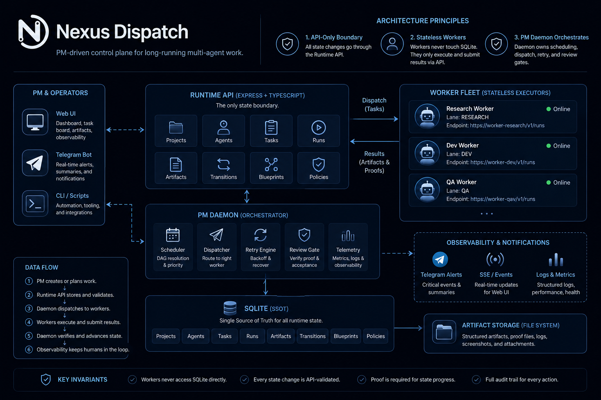

# Nexus Dispatch Architecture

Nexus Dispatch is a single-PM-brain control plane for long-running multi-agent work. The README keeps only the public diagram and the three invariants; this page holds the implementation-level architecture notes.

## Public Diagram



## Runtime Layers

```text
┌─────────────────────────────────────────────────────────┐
│ Human / Visibility Layer                                │
│ Telegram per-agent bots · WebUI read model · Operators  │
└───────────────┬─────────────────────────────┬───────────┘
                │ visible summaries           │ read-only events
                ▼                             ▼
┌─────────────────────────────────────────────────────────┐
│ Runtime API (Express :8000)                              │
│ /api/v1/runtime/*                                        │
│ Tasks · Runs · Agents · Artifacts · Reports · Reviews    │
│ Blueprints · Cron Registry · Project Settings            │
└───────────────┬─────────────────────────────┬───────────┘
                │ scheduling decisions         │ worker registry
                ▼                             ▼
┌────────────────────────────┐   dispatch   ┌────────────────┐
│ PM Daemon Tick Loop         │────────────▶ │ Worker Fleet   │
│ DAG resolution              │◀──────────── │ execute only   │
│ priority / lease / retry    │ proof        │ no scheduling  │
│ review / closeout gates     │              │ no DB access   │
└───────────────┬────────────┘              └────────────────┘
                │ API-internal persistence only
                ▼
┌─────────────────────────────────────────────────────────┐
│ SQLite SSoT + Prisma Repository Boundary                 │
│ Not exposed to Workers, WebUI, Telegram bots, or Daemon   │
│ except through the Runtime API contract                   │
└─────────────────────────────────────────────────────────┘
```

## Three Invariants

1. **Runtime API is the only state boundary.** All reads and writes go through REST. SQLite is internal to the API server process.
2. **Workers are stateless executors.** They receive dispatch, execute, and submit proof. They never touch SQLite or make scheduling decisions.
3. **PM Daemon owns scheduling, dispatch, retry, and review gates.** No agent self-assigns or self-completes.

## Component Responsibilities

| Component | Owns | Must not own |
| --- | --- | --- |
| Runtime API | Auth, validation, project-scoped Repository calls, FSM transitions, artifacts/reports writeback | Long-running scheduling loops or direct Telegram delivery decisions |
| PM Daemon | DAG ordering, priority evaluation, worker dispatch, retries, review spawning, group closeout | Direct SQLite access, Worker execution, human-readable Telegram spoofing |
| Worker Agent | Execute a dispatched task and return structured run/artifact/proof output | Scheduling, dependency resolution, direct task completion, DB writes |
| WebUI | Read model, SSE display, safe proof summaries | Raw proof leakage, direct writes, backend state inference |
| Telegram bot per agent | Human-readable visible notification for its own agent | Sending on behalf of other agents or exposing raw runtime IDs/secrets |

## State and Proof Flow

1. PM or API client creates a project-scoped task through the Runtime API.
2. PM Daemon claims eligible work through Runtime API reads and writes a `Run`/dispatch record.
3. Worker receives the dispatch payload at its registered endpoint.
4. Worker executes outside the control plane and returns structured output.
5. Runtime stores run status, artifacts, proof payloads, and lifecycle transition audit.
6. Review policy decides whether machine proof unlocks downstream or a reviewer task is required.
7. Completion reports and Telegram-visible messages are generated from sanitized summaries, while raw proof remains in runtime storage.

## Boundary Notes

- `data/nexus.db` and `prisma/data/nexus.db` are not public integration surfaces.
- New V8 flows should use Prisma Repository classes behind the Runtime API, not legacy DAL calls.
- Cron registry rows describe project policy; they do not imply that Hermes cronjobs were started or stopped.
- Public README links should point to user-facing operation docs. Engineering proofs and local proof artifacts must stay outside the public repository under `/root/.hermes/projects/nexus-dispatch/docs/proofs/`; public-repo proof paths such as `docs/v8/`, `tmp/guide-proof/`, and `docs/assets/cliproxy-test/` are ignored and must not be reintroduced.
