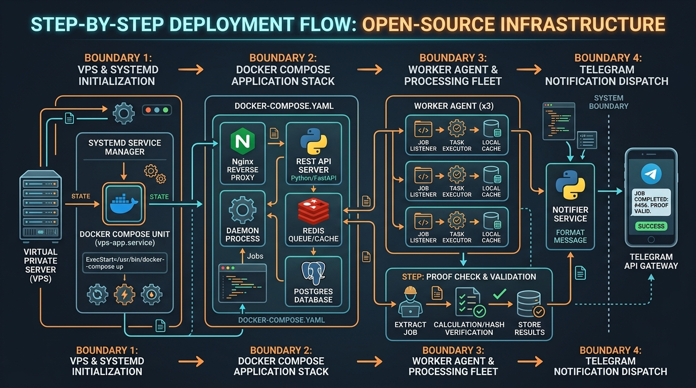
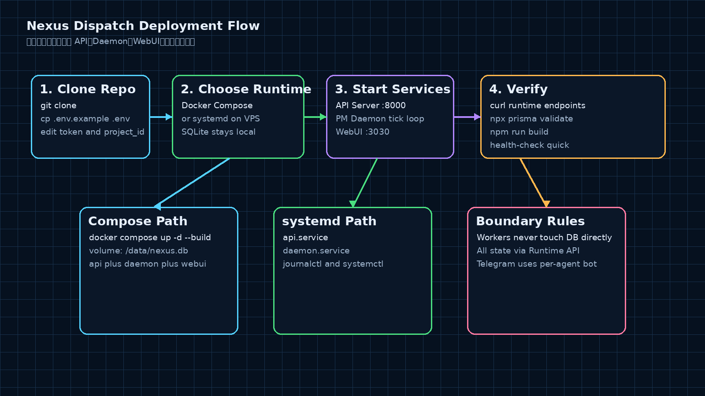
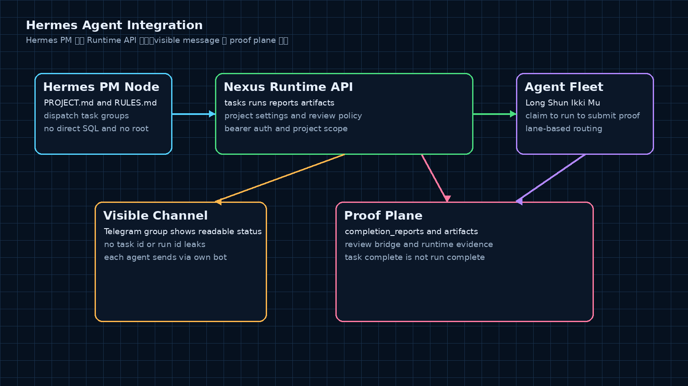
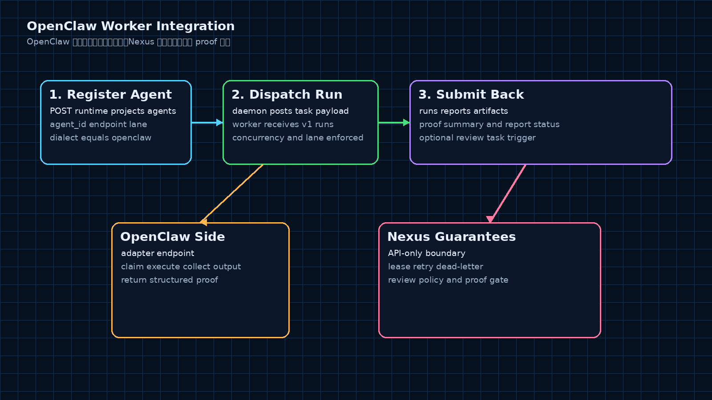
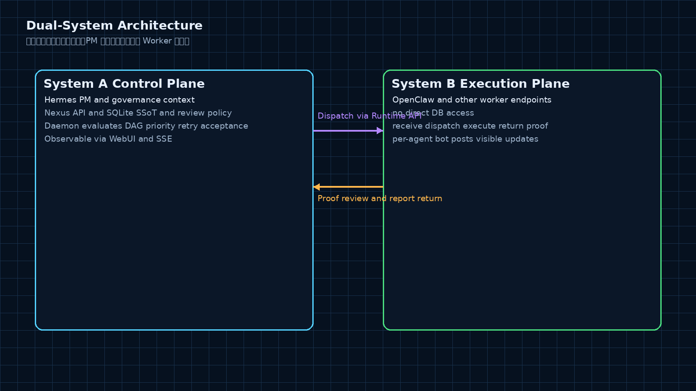
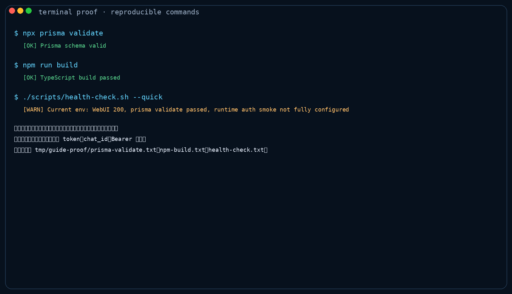

# Installation & Deployment Guide

> R13_API_SERVER_DEPLOY_GUIDE_CONTRACT
>
> This guide is the API Server deployment runbook. For the product overview, see [README.md](../README.md).



## Visual Map

### Deployment flow



### Hermes integration



### OpenClaw worker integration



### Dual-system architecture



### API server verification proof



---

---

## 1. Ports & Endpoints

| Component | Default Port / Entry | Description |
| --- | --- | --- |
| API Server | `PORT=8000` via `npm start` or `node dist/index.js` | Express + V8 Runtime API. All `/api/v1/*` routes require Bearer token auth. |
| Daemon | `npm run daemon` / `node dist/daemon/main.js` | Tick-loop polling the Runtime API. No HTTP port exposed. |
| WebUI | `3030` (Docker Nginx) or Vite dev server port | Read-only observability dashboard via API/SSE. Never writes to the database. |
| SQLite | Docker volume `nexus-sqlite-data:/data` | `DATABASE_URL=file:/data/nexus.db`, managed by Prisma inside the API process. |

There is no `install.sh` one-click script or Swagger UI page. Use the smoke-test commands below to verify the live API.

---

## 2. V8 Runtime API Quick Reference

All `/api/v1/*` requests require:

```bash
  -H "Authorization: Bearer $API_AUTH_TOKEN" \
```

Key endpoints:

```text
GET  /api/v1/events/stream
GET  /api/v1/runtime/tasks/pending?project_id=nexus-dispatch
POST /api/v1/runtime/tasks/:taskId/claim
POST /api/v1/runtime/tasks/transition
POST /api/v1/runtime/runs
PATCH /api/v1/runtime/runs/:runId/status
POST /api/v1/runtime/reports
PATCH /api/v1/runtime/reports/:reportId/status
POST /api/v1/runtime/artifacts
POST /api/v1/runtime/projects/:projectId/agents
GET  /api/v1/runtime/projects/:projectId/agents
GET  /api/v1/runtime/projects/:projectId/review-policies
POST /api/v1/runtime/projects/cronjobs
GET  /api/v1/runtime/projects/:projectId/cronjobs
PATCH /api/v1/runtime/projects/:projectId/cronjobs/:cronjobId/status
POST /api/v1/runtime/blueprints/freeze
POST /api/v1/runtime/blueprints/thaw-current-phase
POST /api/v1/runtime/blueprints/advance-phase
```

Legacy paths (`/api/v1/agents/register`, `/api/v1/tasks/*`) may still exist in historical code but should not be used in production.

---

## 3. Docker Compose Deployment

### 3.1 Prepare

```bash
git clone https://github.com/zcweah1981/Nexus-Dispatch.git /opt/projects/nexus-dispatch
cd /opt/projects/nexus-dispatch
cp .env.example .env
# Edit .env: at minimum set the shared API/Daemon auth token. Never commit .env.
```

### 3.2 Build & Start

```bash
docker compose up -d --build
```

Compose starts:

- **nexus-api** — builds TypeScript, runs `prisma migrate deploy`, listens on container port `8000`. Host port defaults to `${NEXUS_API_PORT:-8000}`.
- **nexus-daemon** — waits for API health, then runs `node dist/daemon/main.js`.
- **nexus-webui** — builds the WebUI, served by Nginx on host port `${NEXUS_WEBUI_PORT:-3030}`.
- **nexus-sqlite-data** — persistent volume at `/data/nexus.db`.

### 3.3 Smoke Tests

```bash
# Container status
docker compose ps

# Auth boundary: no token should return 401
curl -i "http://localhost:${NEXUS_API_PORT:-8000}/api/v1/runtime/tasks/pending?project_id=nexus-dispatch"

# Authenticated request: should return JSON (empty tasks is normal)
curl -sS \
  -H "Authorization: Bearer $API_AUTH_TOKEN" \
  "http://localhost:${NEXUS_API_PORT:-8000}/api/v1/runtime/tasks/pending?project_id=${NEXUS_PROJECT_ID:-nexus-dispatch}"

# SSE stream: should show connected/ping (timeout prevents blocking the terminal)
timeout 5 curl -N -H "Authorization: Bearer $API_AUTH_TOKEN" "http://localhost:${NEXUS_API_PORT:-8000}/api/v1/events/stream"

# WebUI
curl -I "http://localhost:${NEXUS_WEBUI_PORT:-3030}/"

# Comprehensive health script (warnings on first start are expected)
./scripts/health-check.sh --quick
```

### 3.4 Clone to first completed task

The shortest end-to-end path from a clean clone to the first task reaching `completed` is:

1. **Clone and configure**
   ```bash
   git clone https://github.com/zcweah1981/Nexus-Dispatch.git /opt/projects/nexus-dispatch
   cd /opt/projects/nexus-dispatch
   cp .env.example .env
   # Fill API_AUTH_TOKEN and PM_API_TOKEN with the same local secret.
   ```
2. **Apply database migrations and start the API**
   ```bash
   npm ci
   npx prisma generate
   npx prisma migrate deploy
   npm run build
   npm start
   ```
3. **In another terminal, create a project, register one worker, and create one task**
   ```bash
   export API_AUTH_TOKEN="<local-api-token>"
   export NEXUS_PROJECT_ID="nexus-dispatch"

   curl -sS -X POST "http://localhost:8000/api/v1/runtime/projects" \
     -H "Authorization: Bearer $API_AUTH_TOKEN" \
     -H "Content-Type: application/json" \
     -d '{"id":"nexus-dispatch","name":"nexus-dispatch"}'

   curl -sS -X POST "http://localhost:8000/api/v1/runtime/projects/nexus-dispatch/agents" \
     -H "Authorization: Bearer $API_AUTH_TOKEN" \
     -H "Content-Type: application/json" \
     -d '{"agent_id":"long-coder-1","endpoint":"http://worker-host:8647/v1/runs","lane":"DEV","dialect":"openclaw","max_concurrency":1,"status":"online"}'

   curl -sS -X POST "http://localhost:8000/api/v1/runtime/tasks" \
     -H "Authorization: Bearer $API_AUTH_TOKEN" \
     -H "Content-Type: application/json" \
     -d '{"project_id":"nexus-dispatch","id":"first-task","title":"First task","objective":"Verify the API Server lifecycle","lane_required":"DEV","acceptance_mode":"group_only","acceptance_criteria":["task reaches completed through Runtime API transitions"]}'
   ```
4. **Drive the minimal V8 lifecycle through the Runtime API**
   ```bash
   for event in dispatch start submit_completion request_review review_pass; do
     curl -sS -X POST "http://localhost:8000/api/v1/runtime/tasks/transition" \
       -H "Authorization: Bearer $API_AUTH_TOKEN" \
       -H "Content-Type: application/json" \
       -d "{\"project_id\":\"nexus-dispatch\",\"task_id\":\"first-task\",\"event\":\"${event}\",\"proof\":{\"source\":\"install-guide-smoke\"}}"
   done
   ```
5. **Verify the first task**
   ```bash
   curl -sS "http://localhost:8000/api/v1/runtime/tasks/first-task?project_id=nexus-dispatch" \
     -H "Authorization: Bearer $API_AUTH_TOKEN" \
   # Expected: task.status == "completed"
   ```

For real worker operation, start `npm run daemon` after worker registration; the daemon dispatches through registered worker endpoints and workers submit proof back through the same Runtime API boundary.

---

## 4. Local Development

```bash
npm install
cp .env.example .env
npx prisma generate
npx prisma migrate deploy
npm run build
npm start
```

In a separate terminal, start the Daemon:

```bash
npm run daemon
```

WebUI:

```bash
npm --prefix src/webui install
npm --prefix src/webui run build
# Dev mode: npm --prefix src/webui run dev
```

---

## 5. Worker Agent Registration

Workers are external execution nodes — they are **not** bundled inside the Nexus control-plane container. Register via the Runtime API:

```bash
curl -sS -X POST \
  "http://localhost:${NEXUS_API_PORT:-8000}/api/v1/runtime/projects/${NEXUS_PROJECT_ID:-nexus-dispatch}/agents" \
  -H "Authorization: Bearer $API_AUTH_TOKEN" \
  -H "Content-Type: application/json" \
  -d '{
    "agent_id": "long-coder-1",
    "endpoint": "http://worker-host:8647/v1/runs",
    "lane": "DEV",
    "dialect": "openclaw",
    "max_concurrency": 1,
    "status": "online"
  }'
```

The worker endpoint must accept HTTP POST dispatches from the Daemon. Whether it also exposes `/health` depends on the specific worker implementation — Nexus schedules based on the `status`, `lane`, and `endpoint` fields registered in the Runtime API.

---

## 6. Production Deployment Checklist

Before going live, verify every item:

- [ ] `.env` is copied from `.env.example`. Real tokens and chat IDs exist only on the target machine — never in Git.
- [ ] `DATABASE_URL=file:/data/nexus.db` (or equivalent absolute path) is confirmed. The SQLite directory is writable and backed up.
- [ ] `PM_API_TOKEN` matches `API_AUTH_TOKEN`, or is explicitly set per your gateway policy.
- [ ] `NEXUS_PROJECT_ID` points to the current project (e.g., `nexus-dispatch`).
- [ ] `npx prisma validate && npx prisma migrate deploy && npm run build` passes cleanly.
- [ ] API is exposed only via internal network, Tailscale, or reverse proxy. Public endpoints must enforce Bearer token auth and TLS.
- [ ] WebUI does not display raw proof, tokens, chat IDs, run IDs, or other runtime-sensitive identifiers.
- [ ] Daemon only drives task state through the Runtime API. Cron start/stop goes through the `project_cronjobs` registry — reviewed and executed by the external scheduler adapter only.
- [ ] Log rotation, SQLite backup, disk alerts, and process auto-restart (Docker restart policy or systemd) are configured.
- [ ] Smoke/health commands have been run and output saved to the deployment record.

---

## 7. Bare-Metal Deployment with systemd

For VPS machines without Docker. Example service units live in `scripts/nexus-dispatch-api.service` and `scripts/nexus-dispatch-daemon.service`.

```bash
sudo useradd --system --home /opt/projects/nexus-dispatch --shell /usr/sbin/nologin nexus || true
sudo mkdir -p /opt/projects/nexus-dispatch/data /opt/projects/nexus-dispatch/logs
sudo chown -R nexus:nexus /opt/projects/nexus-dispatch

cd /opt/projects/nexus-dispatch
sudo -u nexus npm ci
sudo -u nexus npm --prefix src/webui ci
sudo -u nexus npm --prefix src/webui run build
sudo -u nexus npx prisma migrate deploy
sudo -u nexus npm run build

sudo cp scripts/nexus-dispatch-api.service /etc/systemd/system/
sudo cp scripts/nexus-dispatch-daemon.service /etc/systemd/system/
sudo systemctl daemon-reload
sudo systemctl enable --now nexus-dispatch-api.service
sudo systemctl enable --now nexus-dispatch-daemon.service

systemctl status nexus-dispatch-api.service --no-pager
systemctl status nexus-dispatch-daemon.service --no-pager
journalctl -u nexus-dispatch-daemon -n 80 --no-pager
```

Start/stop order: API first, Daemon second. When restarting, stop Daemon before API to avoid mid-tick failures.

```bash
sudo systemctl stop nexus-dispatch-daemon.service
sudo systemctl restart nexus-dispatch-api.service
sudo systemctl start nexus-dispatch-daemon.service
```

---

## 8. Telegram Delivery Configuration

Nexus follows a strict notification boundary: **each dispatched agent sends via its own bot** — the Daemon and PM never send on an agent's behalf. The Daemon reads `AGENT_NOTIFICATIONS` and looks up only the bot/chat config per `agent_id`; visible language is not configured on the agent. Telegram body language is resolved from the project Runtime setting `visible_language` (`zh-CN` default, `en-US` supported). The example below uses environment variable placeholders:

```bash
AGENT_NOTIFICATIONS='{
  "long-coder-1": {"bot_token": "${LONG_CODER_BOT_TOKEN}", "chat_id": "${NEXUS_GROUP_CHAT_ID}"},
  "shun-designer-1": {"bot_token": "${SHUN_DESIGNER_BOT_TOKEN}", "chat_id": "${NEXUS_GROUP_CHAT_ID}"}
}'
```

Set project visible language through the Runtime API after the project exists:

```bash
curl -sS -X PATCH "$PM_API_URL/runtime/projects/nexus-dispatch/settings/visible-language" \
  -H "Authorization: Bearer $API_AUTH_TOKEN" \
  -H "Content-Type: application/json" \
  -d '{"visible_language":"en-US"}'
```

Production guidelines:

1. Inject real bot/chat values via systemd `EnvironmentFile`, Docker secrets, or environment variables.
2. Never print real tokens or chat IDs in README, compose files, Git-tracked files, or logs.
3. `AGENT_NOTIFICATIONS` stays credential-only (`bot_token`, `chat_id`). Do not add language fields there; language is project-scoped via `visible_language`.
4. Each agent uses its own bot token. If no config exists for an agent, the Daemon silently skips the visible notification — Runtime proof and report still land in the database.
5. Visible messages are human-readable only. Full task/run/dispatch/trace identifiers stay in DB artifacts and reports — never in group chat text.

---

## 9. Cron Scheduler Adapter Boundary

The `project_cronjobs` table is a project-level registry — having a row does **not** mean an external cronjob is running. Current boundary:

- The Runtime API handles bind, query, and status updates: `active | paused | disabled`.
- `enabled_policy` controls adapter filtering: `always_on | manual | project_active | maintenance_only`.
- A Telegram session only selects the current project — it does not auto-start/stop cronjobs.
- The Daemon tick must **not** directly call `cronjob.start/stop/pause/resume`.
- A real scheduler adapter must first read `/api/v1/runtime/projects/:projectId/cronjobs?eligible=true`, then decide whether to launch the external Hermes cronjob based on the project-validated registry.

Recommended pause flow:

```bash
# Pause the registry (does NOT kill the external process — adapter converges on next read)
curl -sS -X PATCH \
  "http://localhost:${NEXUS_API_PORT:-8000}/api/v1/runtime/projects/${NEXUS_PROJECT_ID:-nexus-dispatch}/cronjobs/<cronjob_id>/status" \
  -H "Authorization: Bearer $API_AUTH_TOKEN" \
  -H "Content-Type: application/json" \
  -d '{"status":"paused"}'
```

---

## 10. Logs, migrations, and operational controls

### 10.1 Logs

Docker Compose:

```bash
docker compose logs -f --tail=100 nexus-api
docker compose logs -f --tail=100 nexus-daemon
docker compose logs -f --tail=100 nexus-webui
```

systemd:

```bash
journalctl -u nexus-dispatch-api -f
journalctl -u nexus-dispatch-daemon -f --since "10 minutes ago"
journalctl -u nexus-dispatch-api -n 100 --no-pager
```

Keep visible Telegram text short and human-readable; full runtime IDs and raw proof remain in Runtime DB artifacts/reports.

### 10.2 Database migrations

The API Server owns SQLite/Prisma. Workers, WebUI, and the PM Daemon must not open SQLite directly.

```bash
npx prisma validate
npx prisma migrate deploy
npm run validate:api-deploy -- --skip-health
```

Docker entrypoint runs `npx prisma migrate deploy` before `node dist/index.js` unless `SKIP_PRISMA_MIGRATE=1` is explicitly set for controlled recovery.

### 10.3 PM daemon start/stop

Local:

```bash
npm run daemon
```

systemd:

```bash
sudo systemctl stop nexus-dispatch-daemon.service
sudo systemctl start nexus-dispatch-daemon.service
sudo systemctl restart nexus-dispatch-daemon.service
```

Restart order: stop daemon first, restart/migrate API, then start daemon. This avoids daemon ticks during API migration/restart windows.

### 10.4 Validation script

`npm run validate:api-deploy` runs Prisma validation, the R13 deploy-guide contract, and the V8 Runtime API boundary subset. By default it also probes the live API if `API_AUTH_TOKEN` or `PM_API_TOKEN` is exported.

```bash
npm run validate:api-deploy -- --skip-health     # source/Prisma/test validation only
API_AUTH_TOKEN="<local-api-token>" npm run validate:api-deploy
npm run validate:api-deploy -- --json --skip-health
```

---

## 11. Troubleshooting

| Symptom | Check Command | Common Cause / Fix |
| --- | --- | --- |
| API won't start | `docker compose logs nexus-api` / `journalctl -u nexus-dispatch-api -n 100` | Missing `DATABASE_URL`, migration failure, port conflict. |
| Requests return 401 | Verify the shared auth token in the runtime environment and check the header | Bearer token missing or mismatched. |
| Daemon doesn't dispatch | `docker compose logs nexus-daemon --since=10m` | No pending tasks, agent not online, lane mismatch, worker endpoint unreachable. |
| SQLite not updating | `docker compose exec nexus-api npx prisma validate` | Volume permissions, stale `data/nexus.db` path. |
| WebUI blank | `curl -I http://localhost:3030/` / browser console | WebUI not built, API/SSE URL unreachable, reverse proxy not forwarding SSE. |
| Telegram silent | Check `AGENT_NOTIFICATIONS` JSON parsing | Missing bot config for agent, bad token/chat_id, bot lacks group permissions. |
| Cron not executing | Query `/runtime/projects/:projectId/cronjobs?eligible=true` | Registry paused/disabled, policy mismatch, external adapter not running. |

---

## 12. Verification Commands

```bash
npm run validate:api-deploy -- --skip-health
npm run build
npm test -- --runInBand tests/v8/v8_api_server_deploy_guide.test.ts tests/v8/v8_retire_legacy_routes.test.ts tests/v8/v8_runtime_api_route_boundary.test.ts
npx prisma validate
npm --prefix src/webui run build
docker compose config --quiet
git diff --check
./scripts/health-check.sh --quick || true
```

`validate-api-deploy.js` is source/test oriented and safe to run on developer machines. `health-check.sh` may return warnings or critical status on an empty or non-Docker/systemd environment. It is a deployment-machine inspection tool — source-level delivery is validated by build, test, prisma, and diff-check.
